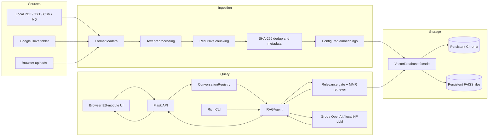
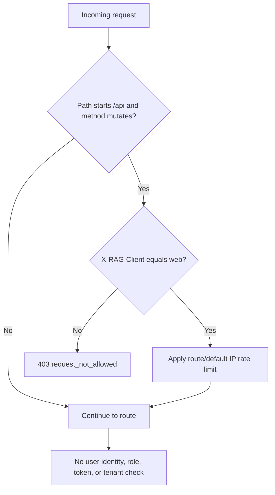
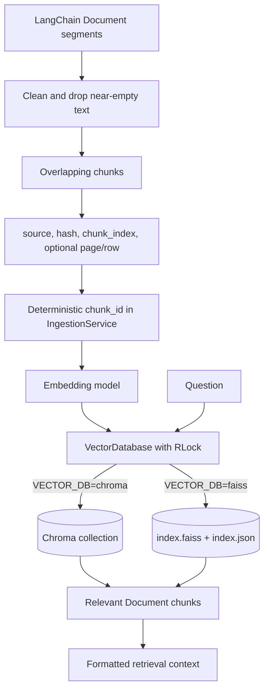
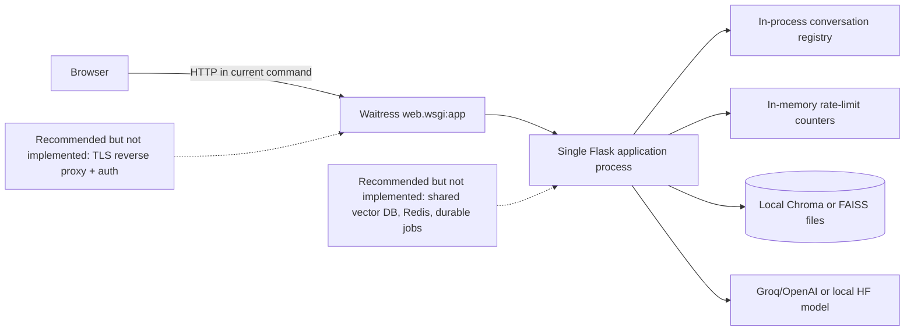
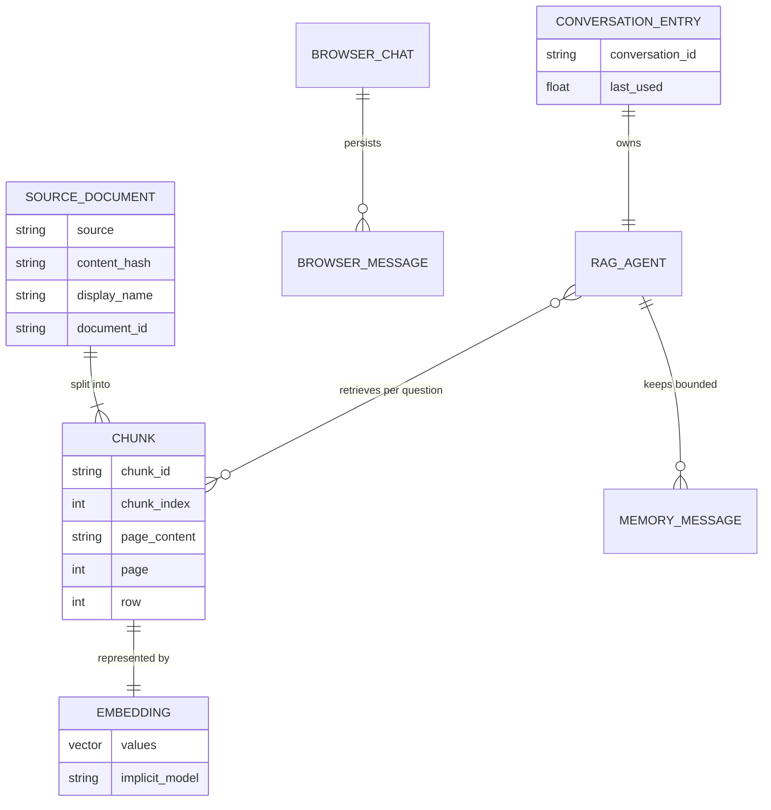
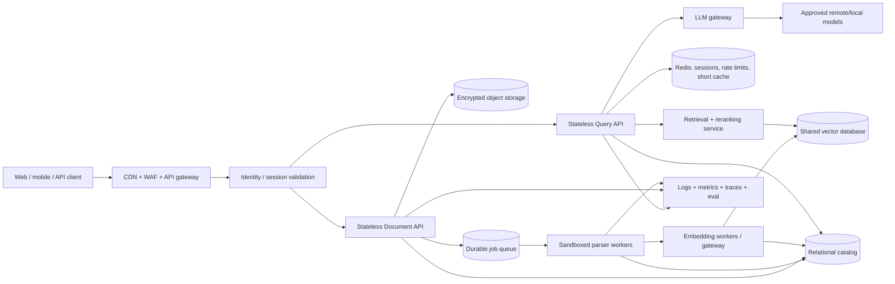

# Agentic RAG Chatbot — Project Interview Preparation

> Repository audit date: 27 July 2026  
> Primary project boundary: the Git-tracked Python/Flask RAG application at the repository root  
> Validation performed: 49 hermetic tests passed; 16 opt-in live E2E tests were skipped because `RUN_E2E` was disabled  
> Confidentiality: configuration names are documented, but no value from the local `.env` file is reproduced here

## How to use this document

This guide separates facts visible in the repository from design proposals:

- **Implemented** means a working code path exists in the tracked application.
- **Partially implemented** means code exists but is not connected everywhere, depends on optional setup, or has a backend-specific limitation.
- **Not implemented / proposed** means it is an interview design improvement, not a current capability.
- **Unverified** means the repository cannot prove the claim without a live provider, deployment, production telemetry, or author confirmation.

### Repository boundary

The Git index, root `README.md`, Python packages, tests, and three-commit history identify the primary product as the Agentic RAG Chatbot. The workspace also contains untracked video files, `video-pipeline/`, `hf-project/`, `hyperframes-edit/`, `solution.cpp`, generated SVG/JPG assets, and `WRITEUP_FORM.md`. Those artifacts are not imported by, packaged with, tested by, or described as part of the tracked RAG application. They must not be presented as RAG architecture or features. This guide discusses them only as out-of-scope workspace material.

### Truthful implementation status

| Status | Capability | Evidence and qualification |
|---|---|---|
| Implemented | Local PDF, TXT, CSV, and Markdown ingestion | `src/ingestion/document_loader.py`, `src/services/ingestion_service.py`, `ingest.py` |
| Implemented | Web upload for the same four formats | `web/api.py::ingest`, `web/services.py::_ingest_file`, `web/static/js/documents.js` |
| Implemented | Text normalization and overlapping recursive chunking | `src/ingestion/preprocessor.py`, `src/ingestion/chunker.py` |
| Implemented | SHA-256 content deduplication | `document_loader.py`, `IngestionService`, and `ApplicationServices._ingest_file` |
| Implemented | Deterministic chunk IDs for reusable/local ingestion | `IngestionService._chunk_id`; web-upload chunks do not set this deterministic ID |
| Implemented | Chroma persistence and FAISS file persistence | `src/vectorstore/vector_db.py` |
| Implemented | Hugging Face or OpenAI embeddings | `src/embeddings/embedding_generator.py` |
| Implemented | Groq, OpenAI, or local Hugging Face chat model selection | `src/agent/rag_agent.py::_get_llm` |
| Implemented | Relevance gate, MMR retrieval, and similarity fallback | `src/retrieval/retriever.py`, `RAGAgent._retrieve` |
| Implemented | Grounded prompt, no-context short circuit, and source return | `src/agent/rag_agent.py` |
| Implemented | Bounded per-conversation memory | `ConversationMemory`, `ConversationRegistry` |
| Implemented | Responsive browser UI and CLI | `web/`, `cli/main.py` |
| Implemented | Browser-local multiple chat histories | `web/static/js/store.js`; these are not server accounts or durable server conversations |
| Implemented | Browser speech recognition and speech synthesis | `web/static/js/voice.js`; browser/vendor dependent |
| Implemented | Document list, preview, delete, and knowledge-base reset with Chroma | `web/api.py`, `web/services.py`, `documents.js` |
| Implemented | API rate limits, request IDs, JSON errors, and security headers | `web/extensions.py`, `web/app.py`, `web/errors.py` |
| Implemented | Optional read-only Google Drive ingestion with retry | `src/ingestion/gdrive_loader.py`; optional packages and credentials are required |
| Partially implemented | Tool-using LangGraph ReAct agent | `create_agentic_executor` and `src/agent/tools.py` exist, but web and CLI instantiate `RAGAgent`, not this executor |
| Partially implemented | Token streaming | `RAGAgent.chat_stream` exists, but there is no SSE/WebSocket/streaming HTTP route and the browser calls non-streaming `/api/chat` |
| Partially implemented | Per-document deletion | Works in Chroma; `_FAISSBackend.delete_source` deliberately raises `NotImplementedError`, which the current API turns into a generic 500 |
| Partially implemented | Google Drive integration | Real adapter exists, but dependencies are optional and the hermetic suite does not test it |
| Partially implemented | Production deployment | Waitress WSGI entry point exists; TLS, authentication, shared state, monitoring, containerization, and automated deployment do not |
| Not implemented | User signup/login, sessions, JWT, refresh tokens, passwords, or RBAC | No authentication model, middleware, endpoint, or UI exists |
| Not implemented | SQL database, ORM, relational migrations, cache, queue, scheduler, or background worker | No corresponding package/configuration/code exists |
| Not implemented | Reranking, hybrid search, multi-hop RAG, evaluation dashboards, or managed vector DB | Mentioned only as future ideas in documentation |
| Unverified | Production traffic, latency, availability, answer quality, cost, and user metrics | No deployment telemetry, benchmark, or evaluation report exists |
| Unverified | Individual/team ownership | Git history has one author identity across three commits, but team roles cannot be proved; use the contribution wording below only if that account is yours |

---

# 1. Project Introduction

## Project name

**Agentic RAG Chatbot**

An interview-safe refinement is **Document-Grounded RAG Assistant with Modular Ingestion and Local Vector Search**. This avoids implying that the currently exposed chat path is a fully autonomous agent.

## One-line description

A Flask and CLI application that ingests local or Google Drive documents, indexes overlapping text chunks in Chroma or FAISS, retrieves relevant evidence, and asks a configurable LLM to answer with document grounding and source references.

## Real-world problem

General-purpose language models do not automatically know a user's private documents and can generate plausible but unsupported answers. This project adds a retrieval layer: it converts documents into searchable vectors, selects relevant chunks for each question, and constrains the model to those chunks. If retrieval finds no sufficiently relevant evidence, the main agent returns a refusal without calling the LLM.

## Target users

- Students or knowledge workers who need to query a small local document collection.
- Developers learning or prototyping retrieval-augmented generation.
- Teams evaluating a single-node, local-first RAG workflow before adopting shared infrastructure.

It is not currently suitable for public multi-tenant use because it has no authentication, authorization, tenant isolation, or production-grade shared state.

## Main use cases

1. Ingest a directory, one file, a browser upload, or an optional Google Drive folder.
2. Ask grounded questions through a responsive browser UI or terminal.
3. Maintain short multi-turn context per conversation.
4. inspect the indexed document list and preview source text.
5. Delete a Chroma-backed document or reset the local knowledge base.
6. Use browser voice transcription and text-to-speech as an alternative input/output mode.

## Why it is useful

The application demonstrates the full RAG lifecycle rather than only an LLM call. It deals with format-specific loading, cleanup, chunking, embeddings, persistence, retrieval quality, prompt injection boundaries, conversation isolation, web API design, failure responses, and testability.

## What makes it technically interesting

- Chat and embedding providers are independently configurable.
- A vector-store facade hides Chroma/FAISS differences.
- Local ingestion uses content hashes and deterministic chunk IDs.
- Retrieval applies a configurable relevance threshold before MMR.
- The LLM is skipped entirely when no usable context exists.
- Expensive embeddings, vector stores, and chat models are lazily initialized.
- The Flask application factory accepts injected fakes, enabling hermetic route tests.
- Conversation agents are bounded, LRU-like, TTL-pruned, and protected by locks.
- FAISS persistence avoids normal pickle loading and only permits a legacy pickle behind an explicit dangerous-deserialization flag.

## My contribution

If the Git author identity belongs to you, a defensible answer is:

> I owned the tracked implementation end to end: document ingestion and deduplication, chunking, provider selection, the Chroma/FAISS abstraction, retrieval and grounded prompting, bounded conversation memory, Flask APIs, the modular browser UI, CLI, security hardening, and the automated test/CI setup. I also documented current operational limits, especially that authentication and distributed state are not implemented.

If this was team work, replace “owned” with the modules you personally changed. The repository does not contain issue assignments, pull-request reviews, or contributor-role documentation, so do not invent a team split.

## 30-second introduction

> I built a document-grounded RAG assistant with Flask and Python. Users can ingest PDF, TXT, CSV, or Markdown files, and the system cleans and chunks them, creates Hugging Face or OpenAI embeddings, and persists them in Chroma or FAISS. For each question it applies a relevance gate, retrieves diverse chunks with MMR, and calls Groq, OpenAI, or a local Hugging Face model only when there is enough context. It supports a web UI, CLI, bounded conversation memory, source previews, and hermetic tests.

## 60-second introduction

> The project solves the problem of asking an LLM questions about private documents without relying on unsupported model knowledge. I separated the system into ingestion, embedding, storage, retrieval, agent, memory, service, API, and frontend layers. During ingestion, files are normalized, split into overlapping chunks, hashed for deduplication, embedded, and stored locally. During chat, a relevance-score check can reject an unrelated question before generation; otherwise MMR selects diverse evidence, the application builds a strict context-only prompt, and the configured LLM returns an answer plus source identifiers. The web app uses a Flask application factory and lazy service container, while route tests inject an in-memory database and fake agent. I also added upload validation, rate limiting, request IDs, security headers, and safe FAISS persistence. The current design is intentionally single-node and has no user authentication, so scaling would require shared vector storage, durable conversations, distributed rate limits, queues, and access control.

## Two-minute explanation

> I designed the project around two flows. The ingestion flow begins in `ingest.py`, the web upload route, or the optional Google Drive adapter. Format-specific loaders produce LangChain `Document` objects with source metadata. The preprocessor normalizes whitespace and drops near-empty content, and `RecursiveCharacterTextSplitter` creates configurable overlapping chunks. `IngestionService` groups by source, computes a SHA-256 content hash, creates deterministic chunk IDs, skips unchanged content, and can replace a changed source in a backend that supports deletion. Embeddings are independently selected as local Hugging Face or OpenAI, and `VectorDatabase` delegates to persistent Chroma or FAISS.
>
> The query flow starts at the browser's `sendQuestion` or the CLI. `/api/chat` validates a bounded conversation ID and question, checks that chunks exist, and delegates to a conversation-scoped `RAGAgent`. The retriever first requests the best relevance score. If it is below `RETRIEVAL_MIN_RELEVANCE`, it returns no context and the agent refuses without calling the model. Otherwise it uses maximum marginal relevance to reduce repetitive chunks, with similarity search as a fallback. The agent wraps retrieved text and recent conversation history in explicit data tags, tells the model to treat both as untrusted data, and invokes Groq, OpenAI, or a local Hugging Face pipeline.
>
> On the engineering side, the Flask application factory injects `ApplicationServices`, making API tests independent of models and persisted data. Conversation memory is a thread-safe sliding window, and the registry caps active conversations and serializes requests per conversation. The frontend is plain ES modules with a typed-style API error wrapper, request timeouts, browser-local chat history, safe HTML escaping before limited Markdown rendering, accessible modals, upload management, and browser voice APIs.
>
> I would be explicit about limits in an interview. The normal UI is retrieval-first RAG, not the optional LangGraph agent executor. Streaming exists only as an unused Python method. There is no authentication or tenant isolation, local state prevents horizontal scaling, FAISS cannot delete one document, and there are no background workers or production observability. Those are the first areas I would redesign for a large deployment.

---

# 2. Project Features

## Feature inventory

### Core user features

- Multi-format local and browser document ingestion.
- Persistent vector indexing with Chroma or FAISS.
- Document-grounded question answering with sources.
- Multiple browser-local chats with bounded server-side memory.
- Document listing, preview, Chroma deletion, and knowledge-base reset.
- CLI commands: `sources`, `clear`, `quit`, and free-form questions.
- Browser voice dictation, read-aloud, and continuous voice mode.

### Supporting features

- Content hashing, duplicate skipping, and changed-source replacement.
- Independent LLM and embedding provider configuration.
- MMR retrieval, relevance gating, and similarity fallback.
- Lazy model/database initialization.
- Structured API errors, request IDs, timeouts, cancellation UI, and toast feedback.
- Responsive layout, focus trapping, inert backgrounds, and reduced-motion CSS.

### Admin-style operations

There is no administrator identity or role. Upload, delete, and reset are operationally “admin-like,” but every caller who can reach the service can invoke them after adding the public static header. Call them **knowledge-base management operations**, not protected admin features.

### Security features

- Validated configuration ranges and provider choices.
- Filename sanitization and temporary upload directories.
- Extension, empty-file, per-file, file-count, and aggregate request-size checks.
- Conversation-ID allowlist.
- SHA-256 content identifiers.
- Prompt-injection boundary instructions.
- Rate limiting using client IP and in-memory counters.
- CSP, clickjacking, MIME-sniffing, referrer, and permissions headers.
- Generic internal-error responses with request IDs.
- Refusal to load legacy FAISS pickle data unless explicitly enabled.

These do not replace missing authentication, authorization, tenancy, encryption, malware scanning, or production secret management.

### Analytics and reporting

No product analytics, audit dashboard, evaluation framework, metrics exporter, or business reporting is implemented. `/api/status` reports the configured model/provider plus local chunk and source counts; logs provide basic operational messages.

### External integrations

- Groq through its OpenAI-compatible base URL.
- OpenAI chat and embeddings.
- Hugging Face embeddings and local text generation.
- Google Drive read-only service-account ingestion.
- Browser Web Speech APIs for speech recognition and synthesis.

## Important feature walkthroughs

### A. Reusable document ingestion

**What and why:** Turns heterogeneous source files into stable vector-search units while avoiding duplicate work.

**Implementation:** `ingest.py::run_ingestion` constructs embeddings, `VectorDatabase`, and `IngestionService`. `load_document` or `load_directory` creates `Document` segments. `preprocess_documents` cleans them. `chunk_documents` performs recursive character splitting. `IngestionService._prepare_by_source` hashes and assigns `chunk_index` and `chunk_id`. `ingest_documents` skips existing hashes, deletes a changed source where supported, and adds selected chunks.

**Flow:** command → source validation → loader → preprocessor → splitter → hash/ID metadata → optional safe reset → dedup/replacement → vector backend → result/logs.

**Handled edges:** missing path, mutually exclusive local/Drive flags, unsupported extension, near-empty content, reset with unusable input, unchanged content, changed source on a backend without per-source deletion, and Ctrl+C.

**Interview questions:** Why hash content? Why deterministic IDs? Why validate before reset? Why group segments by source? What failure remains between deletion and reinsertion?

### B. Browser upload

**What and why:** Adds documents without requiring terminal access.

**Implementation:** `documents.js` filters extensions and sends multipart form data. `web/api.py::ingest` checks count. `ApplicationServices._ingest_file` sanitizes the basename, checks extension/size, saves to a random temporary path, hashes content, skips duplicates, loads/preprocesses/chunks, rewrites metadata to an opaque `upload://<uuid>/<name>` source, and adds it.

**Flow:** file picker/drop → browser extension check → `FormData` → `/api/ingest` → request header/rate limit → service mutation lock → temp file → content pipeline → vector DB → per-file result → status/document refresh.

**Handled edges:** duplicate selection in the browser, duplicate content under another filename, invalid filename, unsupported type, empty file, oversized file, partial batch success, and generic parser failure.

**Limit:** MIME/magic validation, malware scanning, asynchronous processing, and rollback are absent.

### C. Grounded chat

**What and why:** Produces answers from indexed evidence and abstains when evidence is weak.

**Implementation:** `chat.js::sendQuestion` calls `api.chat`. `web/api.py::chat` validates input and conversation ID. `ConversationRegistry.chat` selects a conversation agent and locks it. `RAGAgent.chat` calls `retrieve_with_context`, which applies `_is_relevant`, MMR, and a fallback. The agent either returns `_no_context_answer` or invokes the LLM with `SYSTEM_PROMPT` and `ANSWER_TEMPLATE`.

**Flow:** user question → browser store/UI → POST JSON → Flask validation → conversation registry → retriever/vector DB → prompt/model → memory update → source mapping → JSON → escaped Markdown rendering.

**Handled edges:** empty/long question, missing or invalid conversation ID, empty database, low relevance, MMR exception, no returned chunks, network timeout, invalid JSON response, client abort, and concurrent requests within one conversation.

**Limit:** a browser abort does not guarantee cancellation of the server-side model call.

### D. Conversation isolation

**What and why:** Prevents one browser chat's short-term context from mixing with another.

**Implementation:** browser chat IDs come from `crypto.randomUUID` when available. The API allowlists the ID format. `ConversationRegistry` maps IDs to separate `RAGAgent` instances, caps the map at 100, uses a six-hour TTL during pruning, and has global and per-entry locks. Each `ConversationMemory` retains six user/assistant turns by default.

**Handled edges:** corrupted/disabled local storage, legacy browser history migration, invalid IDs, concurrent requests, clear one conversation, reset all registered memory, and LRU-style eviction.

**Limit:** anyone who knows a conversation ID can address it; server memory is process-local, unauthenticated, and lost on restart.

### E. Document management

**What and why:** Lets users see what is indexed, inspect its extracted text, remove one source, or clear everything.

**Implementation:** `/api/documents`, `/api/documents/content`, `DELETE /api/documents`, and `/api/reset` call storage facade methods through `ApplicationServices`. The browser resolves source IDs, opens an accessible modal, renders content through `textContent`, and refreshes status after mutations.

**Handled edges:** missing source query, nonexistent document, 15,000-character preview truncation, stale modal request abort, focus return, reset confirmation, and Chroma batch reset.

**Limit:** FAISS per-source delete is not implemented, and reset has no backup/undo.

### F. Optional Google Drive ingestion

**What and why:** Imports supported files from a shared Drive folder without manual download.

**Implementation:** `gdrive_loader.py` builds a read-only service-account client, paginates child items, optionally recurses folders with a visited set, exports Google Docs as text, downloads supported files into a temporary directory, and annotates Drive metadata. Retry uses bounded exponential backoff for 429 and selected 5xx responses.

**Handled edges:** missing optional libraries, missing credential path, blank folder ID, pagination, folder cycles/revisits, unsupported MIME types, retryable API errors, and per-file failure.

**Limit:** failures are logged and omitted from the returned document list rather than exposed as a structured per-file result.

### G. Voice interface

**What and why:** Offers speech input, speech output, and a hands-free loop without a backend speech dependency.

**Implementation:** `voice.js` detects standard/prefixed SpeechRecognition, maps UI languages to locales, updates the composer with interim/final transcripts, uses `speechSynthesis`, and runs a modal state machine (`idle`, `listening`, `processing`, `speaking`).

**Handled edges:** unsupported browsers, recognition errors, visibility changes, empty transcripts, modal focus trapping, stopping speech, and a 1.6-second silence trigger.

**Limit:** recognition behavior and data processing depend on the browser/platform, and there are no automated browser tests.

## Incomplete and future features

- Wire `create_agentic_executor` behind a deliberate UI/API mode if tool autonomy is actually required.
- Expose `chat_stream` via SSE or WebSocket and propagate disconnect cancellation into model execution.
- Implement FAISS source deletion by rebuilding the index or make the API reject it with a clear 409/501.
- Add authentication, authorization, tenant-scoped storage, audit logging, and CSRF strategy.
- Move ingestion to a durable queue with progress events and idempotency keys.
- Add hybrid retrieval, reranking, metadata filters, quality evaluation, and feedback.
- Externalize vector data, conversation state, and rate limits for horizontal scaling.

---

# 3. Technology Stack

| Technology | Where used | Why it fits here | Benefits | Limitations | Alternatives and when better |
|---|---|---|---|---|---|
| Python 3.10+ | Backend, ingestion, CLI, tests | Strong ML/NLP ecosystem | Readable, mature libraries, fast prototyping | CPU-bound work and synchronous WSGI need care | Go/Java for high-throughput services; Python remains useful for ML workers |
| Flask 3 | `web/app.py`, `web/api.py` | Small application factory and REST surface | Minimal, injectable, easy testing | No built-in async jobs/auth/schema validation | FastAPI for typed async APIs/OpenAPI; Django for built-in auth/admin/ORM |
| Plain HTML/CSS/ES modules | `web/templates`, `web/static` | Avoids frontend build tooling for a focused UI | Small deployment, transparent behavior | Manual state/rendering, no component/test ecosystem | React/Vue/Svelte for a large interactive frontend |
| LangChain Core and integrations | Document types, messages, embeddings, splitters, stores | Common abstractions around RAG components | Provider adapters and reusable primitives | Version churn and abstraction leakage | Direct provider/vector SDKs for tighter control |
| LangGraph | Optional `create_agentic_executor` | Prebuilt ReAct tool loop | Supports tool-driven workflows | Not wired to current product; adds complexity | Deterministic orchestration for predictable RAG; custom state machine for strict control |
| ChromaDB | Default local vector backend | Embedded persistence and metadata filters | Easy local setup, source deletion | Local single-node design; full metadata scans in several methods | Qdrant/Weaviate/Pinecone/Milvus/pgvector for shared production storage |
| FAISS CPU | Optional local backend | Efficient local similarity index | Fast vector search, offline use | Current adapter lacks per-source deletion; file lifecycle is manual | Chroma for local metadata operations; managed vector DB at scale |
| Hugging Face sentence transformers | Default embeddings | Local, no per-request API charge | Privacy/control after model download | Model download, CPU latency, memory | OpenAI embeddings for managed quality/operations; domain model for specialized retrieval |
| OpenAI embeddings | Optional embeddings | Managed embedding API | No local model hosting | Cost, network, data governance | Local HF for offline/privacy-sensitive workloads |
| Groq via `ChatOpenAI` | Default chat-provider path | OpenAI-compatible endpoint and configured model | Reuses one integration surface | External dependency, rate limits, data egress | OpenAI or local HF based on quality/privacy/cost needs |
| OpenAI chat | Optional LLM | Managed chat API | Mature API ecosystem | Cost, latency, network, governance | Groq for provider choice; self-hosted model for control |
| Transformers + HF pipeline | Optional local chat | Offline/local model route | Data stays local after download | Slow CPU inference and model quality/resource limits | vLLM/TGI/Ollama for more capable local serving |
| `RecursiveCharacterTextSplitter` | `chunker.py` | Boundary-aware configurable chunks | Simple overlap and separator priority | Character count is not token count; no semantic structure | Token-aware/heading-aware/semantic chunking for larger or structured corpora |
| pypdf | PDF extraction | Lightweight text extraction | Pure Python and simple | Scanned PDFs/OCR/layout tables are weak | OCR/document intelligence services for scans and complex layouts |
| Python `csv.DictReader` | CSV loader | Converts rows with column context | No heavy runtime need for this path | Large CSV is materialized into document objects | Streaming ingestion/Polars for very large files |
| Google Drive API | Optional source | Read-only folder ingestion | Pagination, export, service account | Extra credentials/dependencies; not hermetically tested | User OAuth for per-user access; object storage events for production ingestion |
| Flask-Limiter | API limits | Simple decorator/default limits | Reduces obvious request bursts | In-memory and per-process; proxy/IP concerns | Redis-backed limiter/API gateway for distributed deployments |
| Waitress | `web/wsgi.py`, README command | Cross-platform production WSGI server | Easy Windows/Linux serving | Synchronous worker model; not a full edge stack | Gunicorn on Linux; ASGI server after an async API migration |
| Rich | CLI | Readable panels, Markdown, prompts | Better terminal UX | Additional dependency, not business-critical | Standard output for minimal deployments |
| pytest/unittest/pytest-cov | `tests`, CI | Hermetic unit/API tests and coverage command | Good fixtures/mocks, CI-friendly | No frontend/browser coverage; local venv lacked `pytest-cov` during audit | Playwright for UI E2E; load/evaluation tools for RAG quality |
| GitHub Actions | `.github/workflows/ci.yml` | Compile, dependency check, tests, coverage | Automated push/PR verification | No lint, security scan, artifact build, or deployment | Add Ruff/mypy/dependency scan/container deploy stages |
| python-dotenv | `config.py` | Local `.env` convenience | Process env still takes precedence | `.env` is not a production secret manager | Cloud secret manager/Kubernetes secrets/Vault |
| Browser Web Speech APIs | `voice.js` | Voice without backend speech service | Low backend complexity | Compatibility/privacy/vendor behavior varies | Managed or self-hosted STT/TTS for consistent server-controlled behavior |

### Technologies not present

There is no React, TypeScript, Node build system, SQL database, ORM, migration tool, Redis, Kafka/RabbitMQ, Celery/RQ, Dockerfile, Kubernetes manifest, Terraform, cloud deployment file, GraphQL, WebSocket, SSE, or OpenTelemetry setup in the tracked RAG project.

---

# 4. System Architecture

## High-level architecture

The tracked system is a modular single-process application around an embedded vector store. The web frontend and CLI share the same ingestion, vector, retrieval, agent, and memory modules. Local batch ingestion and web ingestion use slightly different orchestration paths.



## Request-response flow

```mermaid
sequenceDiagram
    actor User
    participant JS as chat.js / api.js
    participant Flask as web/api.py
    participant Registry as ConversationRegistry
    participant Agent as RAGAgent
    participant Retriever as retriever.py
    participant DB as VectorDatabase
    participant Model as Configured LLM

    User->>JS: Submit question
    JS->>Flask: POST /api/chat + X-RAG-Client
    Flask->>Flask: Validate JSON, length, conversation_id
    Flask->>DB: count()
    alt No chunks
        Flask-->>JS: Fixed "upload first" response
    else Chunks exist
        Flask->>Registry: chat(id, question)
        Registry->>Agent: chat(question), per-entry lock
        Agent->>Retriever: retrieve_with_context(question)
        Retriever->>DB: best relevance score
        alt Score below threshold or no results
            Retriever-->>Agent: empty context
            Agent-->>Registry: grounded refusal; no LLM call
        else Relevant
            Retriever->>DB: MMR search
            DB-->>Retriever: document chunks
            Retriever-->>Agent: chunks + formatted context
            Agent->>Model: system + context/history/question
            Model-->>Agent: answer
            Agent->>Agent: append bounded memory
            Agent-->>Registry: answer + sources
        end
        Registry-->>Flask: result
        Flask-->>JS: JSON answer and source objects
    end
    JS->>JS: Persist browser history and render escaped Markdown
```

## Authentication and authorization flow

There is intentionally no real authentication flow to diagram. The actual request gate is:



`X-RAG-Client: web` is a spoofable static header. It helps reject accidental form posts and causes cross-origin browser requests to need a preflight, but it is not authentication or authorization.

## Database interaction



## Important ingestion workflow

```mermaid
sequenceDiagram
    participant Entry as ingest.py
    participant Service as IngestionService
    participant Loader as document_loader
    participant Prep as preprocessor/chunker
    participant DB as VectorDatabase

    Entry->>Entry: Validate source before reset
    Entry->>Service: ingest_path(source, reset)
    Service->>Loader: load file or recursive directory
    Loader-->>Service: Document segments + file hash
    Service->>Prep: clean and split by source
    Prep-->>Service: chunks
    Service->>Service: content hash + deterministic chunk IDs
    alt No usable chunks
        Service->>DB: count only; preserve existing index
    else reset requested
        Service->>DB: reset()
        Service->>DB: add selected chunks
    else incremental
        Service->>DB: list hashes and sources
        Service->>Service: skip unchanged; mark changed
        Service->>DB: delete changed source if supported
        Service->>DB: add selected chunks
    end
    Service-->>Entry: IngestionResult
```

## Error-handling and logging flow

Expected route problems raise `ApiError` and return a structured `error` object with `code`, `message`, and `request_id`. Werkzeug `HTTPException` values become JSON on API paths. Unexpected exceptions are logged with a traceback and request ID, while the client receives a generic 500. Frontend `api.js` distinguishes HTTP errors, invalid responses, timeouts, aborts, and network failures.

Logging uses Python's standard `logging.basicConfig` to stdout. It is readable but not structured JSON and has no trace/span, metrics, external sink, alerting, or PII-redaction layer.

## Deployment architecture



The repository provides the WSGI entry point and command, not a deployed production topology. `README.md` explicitly recommends a single application process for the current local-state shape.

---

# 5. Folder Structure

```text
.
├── config.py                     Validated environment-backed settings
├── ingest.py                     Local/Drive ingestion CLI entry point
├── cli/
│   └── main.py                   Interactive Rich terminal client
├── src/
│   ├── agent/                    Grounded RAG agent and optional tools
│   ├── embeddings/               Embedding-provider factory
│   ├── ingestion/                Load, clean, and chunk documents
│   ├── memory/                   Bounded conversation history
│   ├── retrieval/                Relevance gate, MMR, context formatting
│   ├── services/                 Reusable ingestion orchestration
│   ├── utils/                    Logging, hashing, formatting helpers
│   └── vectorstore/              Chroma/FAISS facade and persistence
├── web/
│   ├── app.py                    Flask application factory and middleware
│   ├── api.py                    JSON routes
│   ├── services.py               Lazy services, uploads, conversation registry
│   ├── errors.py                 Typed API errors
│   ├── extensions.py             Rate limiter
│   ├── wsgi.py                   Production WSGI import
│   ├── templates/index.html      Single-page shell
│   └── static/
│       ├── style.css             Responsive and accessible presentation
│       └── js/                   API, chat, store, documents, voice, UI modules
├── tests/                        Hermetic unit/API tests and opt-in live E2E
├── data/documents/               Twelve sample corpus files
├── .github/workflows/ci.yml      Compile, dependency check, test, coverage
├── requirements*.txt             Runtime and development dependencies
├── README.md                     Setup, operations, API, limitations
└── WRITEUP.md                    Assignment-oriented technical summary
```

## Responsibilities and connections

- `config.py` is imported by every infrastructure boundary. It resolves paths, validates choices/ranges at import time, and keeps chat, embeddings, and vector-store selection independent.
- `src/ingestion/` contains small format/stage modules. It returns LangChain `Document` values rather than calling storage directly, which permits orchestration in `IngestionService` and web services.
- `src/services/ingestion_service.py` owns reusable local/Drive ingestion semantics: source grouping, hash normalization, deterministic IDs, deduplication, replacement, and reset ordering.
- `src/vectorstore/vector_db.py` is the storage abstraction. Retrieval, services, web, and CLI depend on its facade instead of Chroma/FAISS classes.
- `src/retrieval/` owns search policy, while `src/agent/` owns prompt/model/memory orchestration. This separation makes retrieval testable without a live model.
- `web/services.py` is an application service container rather than a domain repository. It lazily creates expensive objects, maintains conversation agents, and handles browser uploads.
- `web/api.py` stays thin: parse/validate HTTP, call services, shape JSON.
- `web/static/js/` separates API transport, state persistence, chat rendering, documents, generic UI, Markdown, and voice state. Modules communicate directly and through `rag:*` custom events.
- `tests/` uses fakes for HTTP behavior and opt-in markers for real models/stores. This keeps default CI offline and deterministic.

Generated vector files, virtual environments, caches, media outputs, build directories, and the untracked auxiliary projects are deliberately omitted from the primary structure.

---

# 6. End-to-End Application Flow

## Browser startup

1. `GET /` returns `web/templates/index.html`.
2. The module script loads `main.js`, which runs `bootstrap`.
3. `initializeStore` loads normalized chats from `localStorage`, migrates the legacy key if present, or creates a new chat.
4. `setupChat`, `setupDocuments`, `setupVoice`, `setupSidebar`, and `setupPrimaryActions` attach event handlers.
5. `loadStatus` calls `GET /api/status`. This lazily initializes embeddings and the vector database through `ApplicationServices.database`.
6. The UI updates chunk/model counts and enables the composer only when `chunk_count > 0`.
7. `GET /api/documents` populates the document sidebar.

## Browser chat trace

```text
User presses Send
→ chat.js::sendQuestion
→ store.js::appendMessage and pendingRequests map
→ api.js::api.chat
→ POST /api/chat
→ app.py::assign_request_id and static-header check
→ Flask-Limiter
→ api.py::chat validation
→ ApplicationServices.chat
→ ConversationRegistry.chat
→ RAGAgent.chat
→ retriever.retrieve_with_context
→ VectorDatabase relevance search and MMR/similarity search
→ RAGAgent prompt and configured LLM
→ ConversationMemory update
→ API maps source strings to {name, source}
→ api.js decodes JSON
→ store.js persists answer
→ chat.js escapes/renders limited Markdown and source chips
```

## Upload trace

```text
Drop/select files
→ documents.js::addFiles
→ documents.js::ingestSelectedFiles
→ api.js::ingestDocuments (multipart)
→ POST /api/ingest
→ file-count validation and rate limit
→ ApplicationServices.ingest_files under mutation lock
→ secure_filename + extension/size validation
→ random temporary file + SHA-256
→ load_document → preprocess_documents → chunk_documents
→ opaque upload source and metadata
→ VectorDatabase.add_documents
→ per-file IngestionBatch response
→ loadStatus + loadDocuments
→ composer enabled when chunks exist
```

## Local batch ingestion trace

```text
python ingest.py [--source | --gdrive] [--reset]
→ argument/source validation
→ get_embeddings
→ VectorDatabase
→ IngestionService.ingest_path or ingest_google_drive
→ loader → preprocessor → chunker
→ _prepare_by_source → hash + deterministic IDs
→ optional reset only after usable preparation
→ duplicate skip / changed-source replacement
→ vector add and summary logs
```

## Document preview trace

Click source chip/document view → `openDocumentModal` → abort older modal request → `GET /api/documents/content?source=...` → storage metadata filter → sort chunks by page/row/chunk index → concatenate up to 15,000 characters → JSON → a `<pre>` populated with `textContent`.

## Delete/reset trace

Delete requires browser confirmation and calls `DELETE /api/documents?source=...`. Chroma resolves all IDs with matching source and deletes them. Reset calls `POST /api/reset`, clears the vector backend, and clears all currently registered agent memories. Neither action has authentication, a transaction, backup, or undo.

## CLI trace

`cli/main.py::run_cli` loads embeddings/database, reports counts, and lazily creates `RAGAgent` only for the first real question. `sources` calls `list_sources`; `clear` clears agent memory; `quit` exits. The CLI and browser do not share an agent instance, but they can point at the same local vector files when run against the same configuration.

---

# 7. Database Design

## Database technology

There is no relational application database, ORM, schema migration, SQL table, primary key, or foreign key. The application's persistent data is an embedded vector index:

- **Chroma** by default, using a named collection and persistent directory.
- **FAISS** optionally, using `index.faiss` plus a JSON document store/mapping.

Browser chat history is separately stored in browser `localStorage`, and server conversation memory is an in-process deque/map.

## Logical schema summary

| Logical entity | Fields visible in code | Identity/constraint |
|---|---|---|
| Source document | `source`, optional `display_name`, `document_id`, `content_hash`, type-specific metadata | `source` groups chunks; SHA-256 hash detects identical content |
| Chunk | `page_content`, `source`, `content_hash`, `chunk_index`, optional `chunk_id`, `page`, `row`, Drive fields | Local reusable ingestion creates SHA-256 `chunk_id`; upload path lets backend generate IDs |
| Embedding | Vector produced from `page_content` | Dimension/model controlled by configured embedding provider; model changes require reindex |
| Conversation entry | `conversation_id`, agent, lock, `last_used` | Regex-limited ID; process-local map with max 100 and TTL pruning |
| Message | `role`, `content` | Bounded deque, normally six complete turns |
| Browser chat | `id`, `title`, `messages`, `createdAt` | Browser-generated ID persisted in `localStorage` |

## Relationships



This is a conceptual application model, not a claim about Chroma's internal SQL tables.

## Keys, indexes, and constraints

- Local ingestion's `chunk_id` acts as a stable application key and is passed as the Chroma/FAISS ID when every chunk has one.
- `source` is the grouping/deletion key. Chroma uses metadata filtering; FAISS scans the in-memory docstore for most metadata operations.
- `content_hash` is a SHA-256 checksum used for cross-name duplicate detection.
- `conversation_id` is allowlisted to 1–128 letters, digits, underscores, or hyphens.
- Vector ANN indexes are owned by Chroma/FAISS. The repository does not configure HNSW parameters, database indexes, partitions, or replicas.

## Validation and consistency

- Config validates chunk size/overlap, `TOP_K`, threshold, temperature, token count, upload limits, and provider choices.
- Ingestion copies metadata, groups by source, and prepares all chunks before a requested reset.
- Duplicate hashes are skipped.
- A changed source is deleted before replacement when the backend supports it.
- Database calls are guarded by a process-local `RLock`; web mutations also use `_mutation_lock`.

There is no transaction spanning delete plus add, no write-ahead application log, no version record, and no distributed concurrency control. A crash or failed add after deletion can lose the old version.

## Migration strategy

No formal migration strategy exists. Changing the embedding model/provider requires rebuilding the vector index because stored and query vectors must be compatible. Metadata/schema changes likewise need a controlled re-ingestion script or versioned collection in a production design.

## Important queries

- `similarity_search_with_relevance_scores(query, k=1)` for the relevance gate.
- `max_marginal_relevance_search(query, k, fetch_k)` for the main context.
- Similarity search fallback.
- Chroma `get` with no filter for counts, sources, hashes, and stats.
- Chroma `get(where={"source": source})` for preview/delete.
- FAISS docstore scans for sources, hashes, stats, and preview.

## Performance risks

- Chroma `count`, source lists, content hashes, and stats retrieve large ID/metadata collections rather than using an application catalog.
- FAISS metadata queries scan all documents.
- Preview loads all chunks for one source, then truncates after materialization.
- No pagination exists for document lists or previews.
- One embedding model must match the whole index.

## Database interview questions

**Why is there no SQL schema?** The core query is semantic nearest-neighbor search over chunk embeddings, so the prototype uses an embedded vector store. A production system would likely add a relational document/job/tenant catalog while keeping vectors in pgvector or a vector service.

**How is duplicate data prevented?** SHA-256 content hashes are compared with existing metadata and within the ingestion batch. Local ingestion also uses deterministic chunk IDs. This is application-level deduplication, not a database uniqueness constraint.

**Is replacement atomic?** No. The old Chroma source is deleted before new chunks are added. Production code should write a new document version, validate it, then atomically switch an active-version pointer or use a backend transaction/collection alias.

**Why can FAISS not delete one source?** This adapter deliberately does not implement index compaction/rebuild for source deletion. The correct options are rebuilding the index without those vector IDs, using an ID-mapped/tombstone design, or selecting a backend with metadata-aware deletion.

**How do you maintain embedding compatibility?** Record embedding provider/model/dimension as index metadata and reject mismatches. The current repository documents re-ingestion but does not persist/enforce an index schema version.

---

# 8. API Documentation

All `/api` responses disable caching. Mutating requests must contain `X-RAG-Client: web`, but no endpoint requires an authenticated user or role.

| Method | Endpoint | Purpose | Auth/authz | Request/query | Success response | Main errors | Source |
|---|---|---|---|---|---|---|---|
| GET | `/api/health` | Process liveness | None | None | `{"status":"ok"}` | Default rate-limit/HTTP errors | `web/api.py::health` |
| GET | `/api/status` | Provider/model/chunk/source status | None | None | `status`, `chunk_count`, source names, model, provider | 500 if lazy DB/embedding init fails | `status` |
| POST | `/api/chat` | Ask one conversation-scoped question | Static header only; 30/min route limit | JSON `question` ≤ 2,000 chars, `conversation_id` | `answer`, source objects, echoed ID | invalid JSON, missing/long question, invalid ID, rate limit, model/storage 500 | `chat` |
| POST | `/api/ingest` | Ingest uploaded files | Static header only; 10/min | Multipart `files`, max configured count and per-file size | message, ingested/skipped/errors, new/total chunks | no files, too many, request too large, all files failed | `ingest` |
| GET | `/api/documents` | List indexed sources | None | None | `{"documents":[...]}` | storage 500 | `list_documents` |
| GET | `/api/documents/content` | Preview extracted text | None | Query `source` | name/type/content/truncated/counts | missing source 400; not found 404 | `document_content` |
| DELETE | `/api/documents` | Remove one source | Static header only; 20/min | Query `source` | message, `chunks_removed` | missing 400; absent 404; FAISS currently 500 | `delete_document` |
| POST | `/api/clear-memory` | Remove one server conversation agent/history | Static header only | JSON `conversation_id` | message, boolean `cleared`, ID | invalid JSON/ID | `clear_memory` |
| POST | `/api/reset` | Clear vector store and registered memories | Static header only; 5/min | None | confirmation message | storage 500/rate limit | `reset_database` |

## Detailed API flow 1: `POST /api/chat`

1. `before_request` assigns/accepts an `X-Request-ID` and checks the static client header.
2. Flask-Limiter applies the route limit.
3. `_json_object` requires a JSON object.
4. `chat` trims/coerces `question` and `conversation_id`, validates presence/length/regex, and checks database count.
5. `ApplicationServices.chat` calls `ConversationRegistry.chat`.
6. Registry creates or reuses an agent, updates LRU order/time, and holds its lock.
7. `RAGAgent.chat` retrieves context, optionally invokes the model, updates memory, and returns sources.
8. The route maps each source to a display basename plus original source value.
9. `after_request` adds request/security/no-store headers.

The API returns 200 for both a generated answer and a grounded no-context refusal.

## Detailed API flow 2: `POST /api/ingest`

1. Flask enforces the aggregate `MAX_CONTENT_LENGTH` and client header.
2. The route selects multipart entries with filenames and enforces file count.
3. `ApplicationServices.ingest_files` serializes the batch under `_mutation_lock` and snapshots known hashes.
4. Each file is sanitized, extension/size checked, saved to a temporary directory, hashed, loaded, cleaned, and chunked.
5. Metadata is replaced with an opaque upload source, display name, document UUID, hash, and chunk index.
6. Chunks are added. Each file becomes `ingested`, `skipped`, or `error`.
7. If every file is an error, the API returns a structured 400. Mixed outcomes and all-duplicate batches return 200 with detail arrays.

The operation is synchronous and not transactional across files.

## Detailed API flow 3: `DELETE /api/documents`

1. The static header, default/route rate limits, and `source` query validation run.
2. `ApplicationServices.delete_document` takes the mutation lock.
3. `VectorDatabase.delete_source` delegates to the backend.
4. Chroma fetches matching IDs and deletes them; zero matches maps to 404.
5. FAISS raises `NotImplementedError`; the generic Flask handler logs it and returns 500.
6. The browser refreshes status after a successful delete.

For a production API, backend capability should be checked before presenting the button, and unsupported deletion should return a deliberate 409 or 501.

## API design observations

- Resource naming is mostly REST-like, though reset/clear-memory are action endpoints.
- There is no API version prefix.
- No request/response schema library or OpenAPI document exists.
- Document listing and content have no pagination.
- No idempotency key exists for ingestion/reset/chat.
- Request IDs help support correlation, but clients do not currently generate or display them on errors.

---

# 9. Authentication and Security

## Authentication, signup, login, tokens, and passwords

None are implemented. There is no signup/login flow, identity provider, user model, password hashing, cookie, session, JWT, access token, expiration, refresh token, logout, or account recovery.

## Authorization and protected routes

No RBAC/ABAC or ownership check exists. All data belongs to one shared local knowledge base. A caller can list, preview, upload, delete, reset, and address any syntactically valid conversation ID.

Mutating routes check `X-RAG-Client: web`. This is useful only as a lightweight request-intent check; the value is visible in `api.js` and can be sent by any HTTP client.

## Input validation

Implemented:

- Config choices and numeric ranges.
- JSON-object requirement.
- Required and maximum-length question.
- Conversation ID regex and length.
- Upload count, aggregate size, per-file size, empty file, extension, and sanitized basename.
- Required document `source` query.
- Google Drive folder ID non-empty check.

Missing or limited:

- Schema validation library and typed error locations.
- MIME/magic/content validation and antivirus scanning.
- Semantic limits on extracted PDF pages/chunks, decompression ratio, or parser CPU.
- Source authorization/opaque lookup by authenticated tenant.

## CORS and CSRF

No CORS extension or explicit cross-origin allowlist is configured, so normal browsers enforce same-origin reads. No CSRF token exists. The custom mutation header makes simple cross-site HTML form submissions fail and would trigger a preflight for scripted cross-origin calls, but it is not a full CSRF or authorization design. If cookie authentication is added, use `SameSite`, secure/HTTP-only cookies, origin checks, and a framework CSRF token as appropriate.

## XSS prevention

The frontend escapes `&`, `<`, `>`, quotes, and apostrophes before applying its limited Markdown transformations. User messages use `textContent`; document previews use `textContent`; filenames/attributes pass through `escapeHtml`. A CSP permits scripts only from self and forbids objects/frames, although inline styles remain allowed. These controls reduce XSS risk, but security testing and a maintained Markdown sanitizer would be better than a custom parser as formatting grows.

## Injection prevention

There is no SQL, so SQL injection is not applicable to the current storage. Chroma filters are constructed from a source string through the library API, not query-language string concatenation. Google Drive folder IDs are escaped before being placed in its query string. Prompt injection is addressed by telling the model that retrieved documents and history are untrusted data and must not supply instructions; this mitigates but does not formally eliminate model manipulation.

## Secrets management

`config.py` reads process environment first and `.env` second. `.env` and service-account keys are intended to stay local, and `.env` is ignored by Git. The API no longer exposes debug/secret routes, and tests verify `/api/deepgram-key` and `/api/debug` are absent.

This is not production secret management. Use a managed secret store, rotate keys, restrict provider permissions, and prevent secrets from entering logs, images, or client bundles. The local `.env` contains configured key names and must remain uncommitted; this document intentionally does not reproduce values.

## Rate limiting

Flask-Limiter uses `get_remote_address`, global defaults of 200/day and 60/hour, and route-specific limits for chat, ingest, delete, and reset. Storage is `memory://`, so counters reset on restart and are inconsistent across processes. A reverse proxy also requires deliberate trusted-client-IP handling.

## File-upload security

Good controls include `secure_filename`, basename extraction, random temporary filenames, `TemporaryDirectory`, allowlisted extensions, size/count limits, and opaque persisted source identifiers. Gaps include extension-only type recognition, no malware/OCR sandbox, synchronous parsing, and no extracted-content/chunk ceiling.

## Security headers

`after_request` sets:

- `X-Content-Type-Options: nosniff`
- `X-Frame-Options: DENY`
- `Referrer-Policy: same-origin`
- `Permissions-Policy` restricting camera/geolocation and allowing microphone to self
- CSP with self-only defaults/scripts/connect/fonts, no objects, no foreign frames
- `Cache-Control: no-store` for APIs

HTTPS and HSTS are not configured in the application; they belong at the recommended deployment edge.

## Current security weaknesses

1. No identity, authorization, or tenant isolation.
2. Shared destructive endpoints can be called by any reachable client.
3. Retrieved document text may be sent to external LLM/embedding providers without classification, consent, redaction, or DLP.
4. Local/browser data is unencrypted at the application layer.
5. Upload parsing is not sandboxed or malware-scanned.
6. Rate limits are process-local and IP-only.
7. No security audit log, dependency scan, SAST, or secret scan is in CI.
8. No explicit external-provider timeout/circuit breaker.

## Security interview questions and ideal answers

**Is the application authenticated?** No. The custom header is not identity. I would put the service behind authentication before exposing it, add tenant-scoped documents/conversations, and enforce authorization in the service layer rather than only the UI.

**How is prompt injection handled?** The system labels retrieved text and history as untrusted data and directs the model to use them only as evidence. That is a mitigation, not a guarantee; a stronger design would combine retrieval/content filtering, tool allowlists, structured outputs, output validation, and adversarial evaluation.

**How do you prevent XSS from model output?** The browser escapes model text before applying a narrow Markdown renderer, uses `textContent` for raw content, and has a restrictive CSP. For a production formatter I would use a maintained Markdown parser followed by DOM sanitization and regression tests.

**Why is the static header insufficient?** Anyone can inspect and replay it, so it proves only that a caller knows the expected string. Authentication needs a verifiable user/session or token, and authorization must check the user's permission for the requested document or operation.

**What happens to private data with Groq/OpenAI?** Retrieved chunks and the question leave the host for external providers. The current project has no classification or redaction control, so I would disclose that limitation, obtain appropriate consent/contracts, minimize context, and offer a local-model route for sensitive data.

**How would you secure uploads?** Authenticate and authorize uploaders, verify MIME/magic, cap pages/extracted bytes/chunks, scan content, parse in an isolated worker with CPU/memory/time limits, use object storage quarantine, and only promote a validated document version.

**How would you add cookie sessions safely?** Use secure, HTTP-only, SameSite cookies, server-side session storage, login throttling, CSRF protection for mutations, origin validation, rotation on privilege change, and short idle/absolute expirations.

**How is unsafe FAISS deserialization addressed?** New persistence stores the FAISS index and JSON docstore separately. A legacy pickle is rejected unless `FAISS_ALLOW_DANGEROUS_DESERIALIZATION` is explicitly true; that flag should only be used for a trusted local index.

---

# 10. Important Code Walkthroughs

## 1. `config.py`

- **Responsibility:** Load `.env` without overriding process variables, select providers, resolve paths, and reject invalid settings at startup.
- **Important functions:** `_choice`, `_bool`, `_path`, followed by module-level range checks.
- **Input/output:** Environment strings become normalized constants or an immediate `ValueError`.
- **Dependencies:** `os`, `pathlib`, `python-dotenv`.
- **Pattern:** Centralized configuration with fail-fast validation.
- **Why structured this way:** Every downstream module consumes one validated source of configuration, and provider axes stay independent.
- **Improvement:** Use a typed settings object, validate provider-specific combinations in one method, expose conversation/rate-limit settings, and avoid import-time global state in tests.
- **Likely question:** Why should environment variables override `.env`? Managed deployments inject environment/secrets and must not be silently replaced by a developer file.

## 2. `src/ingestion/document_loader.py`

- **Responsibility:** Convert four file formats into LangChain `Document` segments with source/type/page/row metadata and SHA-256.
- **Important functions:** `_load_txt`, `_load_pdf`, `_load_csv`, `_load_md`, `load_document`, `load_directory`.
- **Input/output:** A file/path becomes zero or more `Document` values.
- **Dependencies:** stdlib CSV/hash/path plus optional `pypdf`.
- **Pattern:** Small loader strategy map (`_LOADERS`) keyed by extension.
- **Why structured this way:** Adding a format is localized to a loader and map entry.
- **Improvement:** MIME verification, streaming large inputs, OCR/layout-aware PDF handling, explicit loader error types.
- **Likely question:** Why does CSV produce one document per row? It preserves row-level retrieval while including column names so values remain interpretable.

## 3. `src/ingestion/preprocessor.py` and `chunker.py`

- **Responsibility:** Normalize whitespace, discard near-empty content, and create overlapping chunks.
- **Important functions:** `clean_text`, `preprocess_documents`, `chunk_documents`.
- **Input/output:** Raw document segments become cleaned, metadata-preserving chunks.
- **Dependencies:** regex and `RecursiveCharacterTextSplitter`.
- **Pattern:** Pipeline stages with single responsibilities.
- **Why structured this way:** Cleaning and splitting can be tested/tuned separately.
- **Improvement:** Use token-aware and structure-aware chunking, configurable minimum content, and corpus evaluation rather than assuming character defaults.
- **Likely question:** Why overlap chunks? It preserves context crossing chunk boundaries, at the cost of storage and duplicate evidence.

## 4. `src/services/ingestion_service.py`

- **Responsibility:** Orchestrate reusable ingestion, deterministic IDs, deduplication, replacement, and safe reset ordering.
- **Important methods:** `ingest_path`, `ingest_google_drive`, `ingest_documents`, `_prepare_by_source`, `_content_hash`, `_chunk_id`.
- **Input/output:** Iterable of `Document` values to immutable `IngestionResult`.
- **Dependencies:** loaders, preprocessor, chunker, `VectorDatabase`.
- **Pattern:** Service layer and deterministic content-addressed processing.
- **Why structured this way:** CLI and Drive paths share semantics without putting business rules in entry points.
- **Improvement:** Versioned/transactional replacement, batch progress, rollback, idempotency records, and shared behavior with browser uploads.
- **Likely question:** Why prepare before reset? Invalid or empty input must not destroy a usable existing index.

## 5. `src/ingestion/gdrive_loader.py`

- **Responsibility:** Read a Drive folder through a service account and turn supported remote files into local `Document` values.
- **Important functions:** `_get_drive_service`, `_api_call_with_retry`, `_list_files`, `_load_folder`, `load_from_google_drive`.
- **Input/output:** Folder ID to document segments with `gdrive://` sources.
- **Dependencies:** optional Google API/auth packages and temporary files.
- **Pattern:** Adapter around an external service plus bounded retry.
- **Why structured this way:** Core ingestion stays source-agnostic.
- **Improvement:** Structured partial-failure result, Retry-After/jitter, request timeouts, incremental change tokens, and tests with a fake Drive service.
- **Likely question:** Which errors are retried? HTTP 429 and 500/502/503/504, for at most three attempts with waits of 1 then 2 seconds before the final attempt.

## 6. `src/embeddings/embedding_generator.py`

- **Responsibility:** Build the configured embedding implementation independently of the chat provider.
- **Important functions:** `get_embeddings`, `_hf_embeddings`.
- **Input/output:** Validated config to a LangChain `Embeddings` object.
- **Dependencies:** `langchain-openai`, `langchain-huggingface` or compatibility fallback.
- **Pattern:** Factory.
- **Why structured this way:** A local embedding model can be combined with a remote LLM, avoiding an unnecessary coupling.
- **Improvement:** Cache/version metadata, health check, dimension validation, batch controls, and clearer deprecation handling.
- **Likely question:** Why normalize Hugging Face embeddings? Cosine-style similarity becomes more consistent when vectors have unit length.

## 7. `src/vectorstore/vector_db.py`

- **Responsibility:** Expose one thread-safe storage interface and implement Chroma/FAISS adapters.
- **Important components:** `_document_ids`, `_ChromaBackend`, `_FAISSBackend`, `VectorDatabase`.
- **Input/output:** Documents and queries in; counts, sources, chunks, and search results out.
- **Dependencies:** LangChain vector integrations, Chroma, FAISS, JSON/filesystem.
- **Pattern:** Facade plus Adapter/Strategy selected by config.
- **Why structured this way:** Retrieval and service layers do not branch on backend.
- **Improvement:** Define a formal backend protocol/capability flags, avoid private FAISS docstore fields, implement deletion/rebuild, record index schema/model, paginate metadata operations.
- **Likely question:** How is FAISS persisted without normal pickle? The native index is written to `index.faiss`, documents/mapping to JSON, and both are replaced from temporary files.

## 8. `src/retrieval/retriever.py`

- **Responsibility:** Decide whether a query is relevant, select chunks, and format evidence.
- **Important functions:** `_is_relevant`, `retrieve`, `format_context`, `retrieve_with_context`.
- **Input/output:** Query and DB to `Document[]` plus a labelled context string.
- **Dependencies:** config and vector facade.
- **Pattern:** Retrieval policy layer.
- **Why structured this way:** Hallucination gating and MMR policy remain independent of prompt/model code.
- **Improvement:** Avoid two embedding/search calls for relevant questions, add calibrated backend-specific thresholds, hybrid retrieval, reranking, and metadata filters.
- **Likely question:** Why can the threshold be tricky? Relevance-score semantics/calibration vary by model and backend, so `0.20` must be evaluated rather than assumed universally meaningful.

## 9. `src/memory/conversation_memory.py`

- **Responsibility:** Keep a thread-safe fixed window of recent user and assistant messages.
- **Important components:** immutable `Message`, `ConversationMemory`.
- **Input/output:** Message content in; copied history/list/dicts out.
- **Dependencies:** deque and `RLock`.
- **Pattern:** Encapsulated bounded buffer.
- **Why structured this way:** Prompt growth is capped at `window * 2` messages.
- **Improvement:** Token-based budgets, durable storage, tenant/user ownership, summarization, and atomic turn insertion.
- **Likely question:** Why store complete turns? A user message without its assistant response can make history incoherent; current separate appends are simple but a turn abstraction would be safer.

## 10. `src/agent/rag_agent.py`

- **Responsibility:** Select the LLM, retrieve evidence, construct grounded messages, invoke/stream, update memory, and optionally construct a ReAct graph.
- **Important parts:** `_get_llm`, `SYSTEM_PROMPT`, `ANSWER_TEMPLATE`, `RAGAgent.chat`, `chat_stream`, `create_agentic_executor`.
- **Input/output:** Question to answer/sources/context.
- **Dependencies:** LangChain messages/providers, retriever, memory, vector DB, optional LangGraph.
- **Pattern:** Application orchestrator; factory for LLM; optional agent builder.
- **Why structured this way:** The normal path stays deterministic and retrieval-first, while experimental agentic behavior is isolated.
- **Improvement:** Provider timeouts/retries, structured citations, context/token budgeting, cancellation, model abstraction injection, and exposing only intentionally supported modes.
- **Likely question:** Does conversation history override grounding? No. The prompt says answer only from retrieved context; history helps resolve dialogue but is not an allowed evidence source.

## 11. `web/services.py`

- **Responsibility:** Lazily initialize expensive services, isolate conversation agents, process uploads, and provide document operations.
- **Important components:** `FileOutcome`, `IngestionBatch`, `ConversationRegistry`, `ApplicationServices`.
- **Input/output:** HTTP-independent service calls and DTO-like dictionaries/dataclasses.
- **Dependencies:** Werkzeug upload utilities and core RAG modules.
- **Pattern:** Dependency-injection container, service layer, registry, lazy initialization.
- **Why structured this way:** `create_app` can inject fakes, and importing the web server does not load models immediately.
- **Improvement:** Unify upload/local ingestion, externalize registry, make limits configurable, add transaction/job abstractions, and return typed service errors.
- **Likely question:** What do the locks protect? `_init_lock` prevents duplicate lazy initialization, `_mutation_lock` serializes web storage mutations, registry lock protects the map, and each entry lock serializes one conversation.

## 12. `web/app.py`

- **Responsibility:** Build/configure Flask, register services/routes/rate limits, assign request IDs, enforce the mutation header, add headers, and normalize errors.
- **Important function:** `create_app`.
- **Input/output:** Optional services/test config to a Flask application.
- **Dependencies:** Flask, Werkzeug exceptions, local web modules.
- **Pattern:** Application factory and middleware hooks.
- **Why structured this way:** Tests instantiate isolated apps and inject in-memory dependencies.
- **Improvement:** Trusted proxy configuration, real auth middleware, structured logging, explicit readiness, HSTS at edge, API versioning.
- **Likely question:** Why lazy services with an app factory? Test collection and liveness can run without model downloads, API keys, or a persisted vector DB.

## 13. `web/api.py`

- **Responsibility:** Define all JSON endpoints, perform request-level validation, call services, and shape stable responses.
- **Important functions:** `_json_object` and nine route handlers.
- **Input/output:** HTTP requests to JSON.
- **Dependencies:** Flask, limiter, `ApplicationServices`, `ApiError`.
- **Pattern:** Thin controller/Blueprint layer.
- **Why structured this way:** Business/storage logic is not duplicated in route handlers.
- **Improvement:** Schema library/OpenAPI, authentication/authorization decorators, pagination, idempotency, explicit backend-capability errors.
- **Likely question:** Why return source `name` and `source`? The name is safe for display, while the opaque/full source identifies the document preview endpoint.

## 14. `web/static/js/api.js`, `chat.js`, and `store.js`

- **Responsibility:** Centralize fetch behavior; coordinate pending chat requests/rendering; persist normalized multi-chat state in the browser.
- **Important parts:** `request`, `ApiError`, `sendQuestion`, `pendingRequests`, `initializeStore`, `appendMessage`.
- **Input/output:** UI actions to API JSON and DOM/localStorage updates.
- **Dependencies:** Browser Fetch, AbortController, DOM, localStorage.
- **Pattern:** API gateway module, small client store, controller/view functions.
- **Why structured this way:** Transport failures, state persistence, and rendering are separately understandable without a framework.
- **Improvement:** TypeScript/runtime schemas, server-backed history, bounded local history, true streaming, frontend tests, and end-to-end cancellation.
- **Likely question:** Does AbortController stop the LLM? It stops the browser request/UI; under WSGI the backend may keep executing unless explicit cancellation is propagated.

## 15. `tests/` and `.github/workflows/ci.yml`

- **Responsibility:** Verify preprocessing, chunking, loaders, memory, retrieval guard, deterministic ingestion, Chroma operations, Flask API behavior, headers, and optional live integration.
- **Important files:** `test_pipeline.py`, `test_backend_hardening.py`, `test_web_api.py`, `test_e2e.py`, `ci.yml`.
- **Input/output:** Fakes/temp stores/config patches to assertions and CI status.
- **Dependencies:** pytest, unittest, mocks, optional pytest-cov.
- **Pattern:** Test pyramid with hermetic default and opt-in live tests.
- **Why structured this way:** CI remains offline and avoids model cost/non-determinism.
- **Improvement:** JavaScript/Playwright tests, Drive/provider contract tests, FAISS round-trip, concurrency/load, security tests, meaningful RAG evaluation, and enforced coverage threshold.
- **Likely question:** What did the audit run? All default tests with a permitted temporary directory: 49 passed and 16 live E2E cases skipped.

---

# 11. Engineering Decisions

| Decision | Selected approach and likely reason | Advantages | Disadvantages | Alternative / scale change |
|---|---|---|---|---|
| Modular monolith | One Python codebase/process with layered modules | Simple local deployment and debugging | Shared failure/scaling boundary | Keep modular monolith initially; split ingestion workers/model gateway only when load/ownership justifies it |
| REST-style JSON API | Flask Blueprint endpoints | Browser/CLI-friendly and familiar | No generated schema or subscriptions | FastAPI/OpenAPI for stronger contracts; gRPC for internal high-throughput services |
| Embedded vector DB | Chroma default, FAISS optional | Low setup and offline use | Single-node files and metadata scans | Shared Qdrant/pgvector/etc. with tenant filters and replicas |
| Dense retrieval with MMR | Relevance gate then MMR, similarity fallback | Diverse context and refusal path | Two searches and threshold calibration | Hybrid BM25+dense, reranker, query rewriting |
| Retrieval-first normal chat | Always retrieve before LLM | Predictable and easier to secure/test | Less flexible than autonomous tool planning | Use a controlled agent only for multi-step workflows |
| Provider independence | Separate LLM/embedding/vector settings | Flexible cost/privacy combinations | More compatibility states to test | Provider registry plus capability tests |
| Sliding-window memory | Six recent turns in process | Bounded prompts and simple isolation | Lost on restart; not token-aware | Redis/DB history with token budgeting/summaries |
| Application factory + injection | `create_app(services=...)` | Hermetic tests and lazy resources | Small custom container | Formal DI framework is unnecessary at current size |
| Browser localStorage for chats | Client-side history and titles | No backend database required | Sensitive, device-local, unbounded, no account sync | Authenticated server history with retention controls |
| Synchronous ingestion/chat | Request completes work inline | Straightforward behavior | Occupies worker and poor long-job UX | Queue/worker and progress events |
| Static client header | Lightweight mutation-intent check | Blocks accidental form posts | Spoofable; no identity | Real auth, CSRF/origin policy, gateway |
| Safe FAISS JSON docstore | Avoid default pickle for normal persistence | Reduces arbitrary pickle deserialization risk | Uses private LangChain fields and lacks deletion | Managed store or custom ID-mapped persistence |
| Plain JS frontend | No build pipeline | Small, fast deployment | Manual DOM/state and no type safety | React/Vue/Svelte when UI complexity/team size grows |

### Monolith versus microservices

The current modular monolith is the right complexity for a placement project and single-node prototype. Microservices would add network failure, deployment, discovery, tracing, and data consistency costs without evidence of independent scaling needs. At scale, first extract asynchronous ingestion because it is resource-heavy and operationally different from low-latency querying; a model gateway may follow if multiple apps share providers.

### JWT versus sessions

Neither is implemented. For a same-origin web application, secure server-side sessions in HTTP-only cookies are often simpler and safer than browser-stored JWTs. JWTs are useful for independently deployed API consumers, but revocation, rotation, audience/issuer validation, and refresh handling must be designed.

### Polling versus WebSockets/SSE

No background job polling or server push exists. For one-way token/progress streams, SSE is simpler than WebSockets. WebSockets become valuable only for bidirectional real-time interactions or many event types.

---

# 12. Design Patterns and Principles

## Patterns actually present

| Pattern/principle | Where | Benefit | Improvement |
|---|---|---|---|
| Layered architecture | loaders → services → storage/retrieval → agent → API/UI | Separates HTTP, business policy, and infrastructure | Formalize interfaces and error types |
| Facade | `VectorDatabase` | One stable storage API | Add backend protocol and capabilities |
| Adapter/Strategy | `_ChromaBackend`, `_FAISSBackend`; loader map | Swap implementations behind common behavior | Contract tests for both backends |
| Factory | `get_embeddings`, `_get_llm` | Central provider construction | Inject factory/clients for broader unit tests |
| Service layer | `IngestionService`, `ApplicationServices` | Reuse orchestration and keep routes thin | Merge divergent web/local ingestion semantics |
| Application factory | `create_app` | Isolated configuration and test injection | Add environment-specific config objects |
| Middleware/hooks | Flask `before_request`, `after_request`, error handlers; limiter | Cross-cutting request behavior | Real auth, tracing, trusted proxy handling |
| Repository-like facade | `VectorDatabase` | Domain modules avoid direct backend SDK use | It is not a full repository/UoW; add transactions/version catalog if needed |
| Dependency injection | `create_app(services=...)`, `ApplicationServices(database, agent_factory)` | Tests run with fakes | Inject model/retriever into `RAGAgent` too |
| Bounded buffer | `ConversationMemory` deque | Predictable memory/prompt size | Bound by tokens and complete turns |
| Registry | `ConversationRegistry` | Conversation isolation and lifecycle | External distributed store and ownership |
| Observer/event pattern | Browser `rag:*` custom events | Decouples chat/document/voice/sidebar modules | Central event typing if frontend grows |
| Reusable component functions | JS render/setup helpers | UI reuse without framework | Component tests and clearer state transitions |

## SOLID assessment

- **Single Responsibility:** Strongest in loaders, preprocessor, chunker, retriever, errors, and frontend modules. `ApplicationServices` and `rag_agent.py` hold several related concerns and could split at scale.
- **Open/Closed:** Loader map and storage/provider branches allow extension, but adding a new provider still requires editing factories.
- **Liskov Substitution:** Storage backends mostly substitute, but FAISS violating `delete_source` capability shows the interface is too strong.
- **Interface Segregation:** Not explicit in Python protocols. Read/search and mutation capabilities should be separate.
- **Dependency Inversion:** High-level modules depend on `VectorDatabase`, but the concrete class still constructs concrete backends from global config. Injection in web tests is a practical partial implementation.

## Patterns not forced onto the code

There is no clear Singleton, MVC model layer, Unit of Work, event sourcing, CQRS, abstract factory hierarchy, or message-broker observer. Lazy application properties are process-local cached objects, not a formal Singleton pattern.

---

# 13. Scalability Analysis

No production load test exists. The following user counts and capacity statements are illustrative design scenarios, not measured claims.

## Current behavior by scale

| Scenario | Likely current behavior | First bottleneck / risk |
|---|---|---|
| About 100 light users | Could be usable on one adequately sized host if questions are sparse and corpus is small | Synchronous model calls, provider rate limits, per-IP/default limits, only 100 registry entries |
| 10,000 users | Unsuitable without redesign | Process-local conversations/rate limits, local vector files, no auth/tenancy, WSGI concurrency, synchronous uploads |
| 1 million users | Architecture cannot support it as written | All single-node assumptions, cost, storage, partitioning, availability, operations |
| High read/query traffic | DB searches and external LLM calls serialize through host resources/provider quotas | Local store/embedding CPU, WSGI threads, model latency |
| High write/ingestion traffic | Web mutations serialize under one `_mutation_lock` and parse/embed synchronously | Queue absence, CPU/memory, partial failure |
| Large files | Aggregate/per-file bytes are bounded, but extracted text/pages/chunks are not separately bounded | Parser/embedding memory and long request |
| Concurrent requests | Separate conversations can run concurrently; one conversation is serialized; vector facade locks each operation | Shared process resources and local store behavior |
| Growing database | Search may remain acceptable initially, but metadata listing/count/hash operations materialize/scan large sets | O(n)-style metadata operations and local disk |
| External-service failure | Google Drive retries selected statuses; LLM/embedding calls generally fail the request | No timeout policy, backoff, circuit breaker, queue, or fallback |

## Evolution path

### Stage 1: safer single-node

- Add real authentication and one-owner/tenant authorization.
- Add explicit provider timeouts, bounded retries, readiness, structured logs, and metrics.
- Limit extracted pages/characters/chunks.
- Add a document catalog in SQL and versioned ingestion.
- Run Waitress behind TLS reverse proxy and keep one application process while state is local.

### Stage 2: shared horizontal web tier

- Move conversations and distributed rate counters to Redis or a database.
- Move vectors/documents to a shared vector service/object store.
- Put stateless API replicas behind a load balancer.
- Move ingestion to a durable queue and worker pool.
- Use SSE for job progress and optional token streams.
- Add CDN only for static assets; private API/document data should not be publicly cached.

### Stage 3: very large multi-tenant platform

- Tenant-aware document catalog, encryption keys, quotas, audit logs, and lifecycle policies.
- Partition vectors by tenant/collection and shard only after measured need.
- Read replicas for relational catalog reads; replicas do not solve vector-write or model bottlenecks alone.
- Hybrid retrieval and reranking services with cached embeddings/query results where privacy permits.
- Autoscaled inference/model gateway, budget enforcement, and provider failover.
- Multi-region strategy based on data residency and acceptable consistency.

## Scaling techniques and relevance

- **Horizontal scaling:** Not possible safely until state is externalized.
- **Load balancing:** Useful after API instances become stateless.
- **Database indexing:** Add indexes on tenant/document/status/hash in a future relational catalog; vector ANN is already delegated to backend.
- **Read replicas:** Useful for catalog/read-heavy operations, not current embedded files.
- **Sharding:** Premature now; later shard by tenant/collection to minimize cross-shard search.
- **Caching:** Cache immutable document metadata and safe repeated retrievals; never cache across tenants. Answer caching needs model/version/document-version keys.
- **CDN:** Serve JS/CSS; do not expose private document previews.
- **Queues/workers:** Highest-value change for upload/Drive parsing, chunking, and embedding.
- **Pagination:** Required for document lists, chunks, jobs, and conversations.
- **Connection pooling:** Relevant after adopting external SQL/vector/Redis services; not configured now.
- **Event-driven architecture:** Useful for `DocumentUploaded → Parsed → Embedded → Indexed → Ready`, but adds eventual consistency.
- **Microservices:** Extract only proven independent workloads; do not make every current folder a service.

---

# 14. Performance Analysis

| Potential issue | Why it may occur | Impact | How to measure | Improvement |
|---|---|---|---|---|
| Two retrieval calls per relevant question | Score gate searches `k=1`, then MMR embeds/searches again | Extra query embedding and vector latency | Trace embedding/search timings and call counts | Reuse scored candidates, calibrate a single search, or expose scores from MMR pipeline |
| Synchronous LLM invocation | Flask handler waits on network/model | Worker occupancy and tail latency | p50/p95/p99 route/model duration, active workers | Timeouts, async job/streaming architecture, sufficient workers, provider gateway |
| Synchronous upload parsing/embedding | Entire pipeline runs in request and mutation lock | Timeouts and poor concurrency | Stage timings, queueing time, CPU/memory | Durable ingestion workers and progress API |
| Vector facade global lock | One `RLock` per DB guards searches and metadata operations | Contention under concurrent reads/writes | Lock-wait profiling and throughput tests | Backend-aware read concurrency, shorter critical sections, external store |
| Chroma full metadata retrieval | `get_document_stats`, hashes, sources scan metadata | Slow status/list at corpus growth | Corpus-size benchmark and returned bytes | Separate document catalog and incremental counters |
| FAISS docstore scans | Metadata operations iterate every document | O(n) management latency | Profile list/hash/preview at increasing chunks | Side index/catalog keyed by source/hash |
| No document pagination | All document records returned | Large JSON/DOM and repeated status work | Payload size and render time | Cursor/limit pagination and cached summaries |
| Preview materializes all source chunks | Truncation happens after fetch | Memory/latency for large document | Preview query memory and source chunk count | Fetch limited ordered chunks or store canonical extracted text |
| Overlap duplicated in preview/context | Chunk overlap repeats text | Larger payload/prompt and preview duplication | Token count/repeated n-grams | De-overlap for preview; retrieval dedupe/rerank |
| Browser full re-render of chat list/thread | `innerHTML` rebuild and message DOM recreation on selection | UI slowdown for long histories | Performance panel, DOM node count | Paginate/virtualize history and incremental rendering |
| Unbounded browser history | `localStorage` keeps all chats/messages until deletion | Quota failure and slow serialization | Storage bytes and persist time | Retention/size cap and server persistence |
| Local HF model loading | First embedding/status or first chat loads model | Large cold start | cold/warm startup and memory | Warmup/readiness, dedicated model server, smaller/optimized model |
| Broad generated answer/prompt sizes | Config permits large output; context top-K chunks plus history | Cost and latency | Prompt/completion tokens and context bytes | Token budgeter, chunk/rerank tuning, max history tokens |
| Missing response streaming | UI waits for full `/api/chat` result | Poor perceived latency | Time-to-first-byte vs full duration | Wire SSE to `chat_stream`, with disconnect cancellation |
| No caching | Repeated identical queries repeat embedding/search/model | Cost and latency | duplicate-query rate/cache simulation | Versioned retrieval/answer cache where privacy allows |

### N+1 assessment

There is no ORM or classic SQL N+1 query. However, status currently calls `database.count` and `list_sources`, then the frontend separately calls `/api/documents`, causing repeated metadata work. Chat also performs a relevance search and then a second retrieval search. These are repeated-call inefficiencies rather than ORM N+1.

### Memory assessment

Server conversation count and per-agent message history are bounded. Potential unbounded areas are corpus metadata materialization, document chunks created for large inputs, model memory, and browser localStorage/history. The upload byte cap does not guarantee a cap on PDF page count or extracted text amplification.

---

# 15. Reliability and Failure Handling

| Failure | Current behavior | Gap / improvement |
|---|---|---|
| Invalid input | Structured 400s for JSON, question, ID, upload, and source errors | Add formal schemas and field-level errors |
| Empty database | Chat returns fixed “upload first” answer | Correct, but status/readiness should distinguish empty from unavailable |
| Low relevance | Agent refuses without LLM invocation | Evaluate thresholds and log safe metrics |
| MMR failure | `RAGAgent._retrieve` retries with similarity search | Broad exception catch can mask root cause; tag fallback in response/metrics |
| Database initialization failure | Status/chat becomes generic logged 500 | Add readiness, operator diagnostic, retry policy |
| Database write failure | Upload returns per-file generic error; local CLI returns nonzero for selected exceptions | No rollback/version transaction; partial writes possible |
| Network failure in browser | `api.js` reports a network error | Safe retry UI for idempotent requests only |
| Browser timeout | 45 seconds default, 120 seconds upload | Backend may continue work; propagate cancellation |
| Authentication failure | Not applicable because authentication is absent | Implement 401 vs 403 semantics |
| Authorization failure | Not applicable because authorization is absent | Enforce tenant/resource access in services |
| External LLM/embedding failure | Usually generic 500/CLI error | Explicit timeout, retry only transient/idempotent calls, circuit breaker |
| Google Drive transient error | Up to three bounded exponential-backoff attempts | Add jitter, Retry-After, structured failed-file report |
| Duplicate request | Content hashes skip duplicate document content | Chat/reset have no idempotency key; repeated chat can double model cost/history |
| Partial batch upload | Successful/skipped/error outcomes returned together | Persist job state and allow targeted retry |
| Changed-source replacement | Old Chroma source deleted, then new chunks added | Versioned atomic cutover to prevent data loss |
| Application restart | Chroma/FAISS persists; browser localStorage persists; server conversations/rate counters disappear | External state and graceful shutdown |
| Multiple processes | Each has separate registry/rate limits; local store concurrency not designed/documented | One process now; shared services later |
| Interrupted FAISS save | Temp files plus `os.replace` per file | The pair is not replaced atomically as one transaction; add manifest/versioning |

## Proposed reliability controls

- **Retries:** Only for transient operations and with bounded attempts. Avoid blind retry of reset/delete/chat because side effects or model billing may duplicate.
- **Exponential backoff with jitter:** Already basic for Drive; extend through a provider client policy.
- **Circuit breaker:** Stop flooding an unhealthy LLM/embedding provider and fail fast with a clear dependency status.
- **Idempotency:** Accept an upload/idempotency key stored with document job/version; hash already provides content-level dedup but not full request-result replay.
- **Dead-letter queue:** For ingestion jobs that repeatedly fail parsing/embedding.
- **Health checks:** Keep `/health` as liveness; add `/ready` checking configuration, vector connectivity, and optionally model/provider dependency with tight timeouts.
- **Graceful shutdown:** Stop accepting work, finish/cancel bounded requests, flush job state, close vector/model clients.
- **Structured logging:** JSON with timestamp, level, request/job/conversation hash, stage, duration, error class; never log secrets or full private text.
- **Monitoring:** Request/error/latency, provider failures, retrieval scores, queue depth, ingestion stage duration, index size, refusal rate, and quality evaluation.
- **Alerts:** Sustained 5xx, readiness failure, queue backlog, provider saturation, disk exhaustion, and unusual destructive operations.

---

# 16. Testing Strategy

## Existing tests

| Layer | Evidence |
|---|---|
| Unit | Text cleanup, chunking, memory, context formatting, config, relevance gate |
| Component/integration | File loaders with temporary files, deterministic ingestion with fake DB, Chroma facade with fake embeddings, safe FAISS reset |
| API | Flask app with injected fake DB/agent; validation, isolation, upload sanitization/dedup, delete/reset, headers, removed secret routes |
| Live E2E | Real embeddings/vector DB/LLM and agent tools behind `RUN_E2E=1` |
| CI | Python 3.12, `pip check`, compileall, hermetic tests, coverage report command |

## Audit result

Using the repository virtual environment and a workspace-local pytest temporary directory:

- **49 tests passed.**
- **16 E2E tests were skipped by their intended `RUN_E2E != 1` condition.**
- The first run's five temp-folder errors were caused by sandbox denial of the default Windows temp path; rerunning with an allowed base temp passed.
- Local coverage could not be generated because the existing virtual environment did not have the declared `pytest-cov` plugin installed. CI installs `requirements-dev.txt`, so its workflow is configured to produce a term coverage report, but there is no stored percentage or threshold in the repository.

## Mocking strategy

- `FakeDatabase` stores LangChain documents in memory.
- `FakeAgent` tracks per-instance history and produces deterministic answers.
- `_get_llm` is patched for the no-context guard.
- Config values are patched for backends/thresholds.
- `FakeEmbeddings` provides deterministic small vectors for Chroma.

This isolates logic from network calls, model downloads, credentials, and the real persisted store.

## Important untested areas

- Browser JS behavior, accessibility, responsive UI, voice APIs, and localStorage limits.
- Groq/OpenAI/Hugging Face provider contracts in normal CI.
- Google Drive pagination/download/retry/partial failure.
- FAISS add/save/safe-load/search round trip and legacy migration.
- Rate-limit behavior and reverse-proxy IP handling.
- Oversize/empty/unsupported/malformed PDF upload cases in API tests.
- Real concurrency between search, upload, delete, reset, and restart.
- Prompt-injection/adversarial documents and citation correctness.
- RAG retrieval/answer quality with a labelled evaluation dataset.
- Atomicity and recovery from mid-write failures.

## Sample test scenarios

### Successful operations

- Ingest one file, verify hash/metadata/chunk count, query a known fact, verify source mapping.
- Upload mixed formats, list/preview each, delete one under Chroma, reset.
- Two conversation IDs receive isolated turn counts.

### Validation failures

- Non-object JSON, empty/2,001-character question, invalid ID characters/length.
- Zero files, more than `MAX_UPLOAD_FILES`, empty/oversize/unsupported/malformed content.
- Missing/unknown document source.

### Authentication/authorization failures

These cannot be meaningfully tested until implemented. Current tests only prove the static mutation header returns 403 when absent. After auth, test missing/expired/forged credentials, cross-tenant IDs, normal-user reset, and revoked sessions.

### Database failures

- `count`, search, add, delete, reset, and save throw controlled exceptions.
- Add fails after changed-source deletion: verify version rollback in the redesigned service.
- FAISS index/JSON missing, mismatched, corrupt, or partially replaced.

### Edge cases

- Same bytes under different filenames are skipped.
- Same source with changed bytes is replaced in Chroma and rejected clearly in FAISS.
- Low relevance does not call MMR/LLM.
- MMR raises and similarity succeeds/fails.
- Browser cancels while backend is running.
- Multiple simultaneous messages to one conversation remain ordered.

## Testing improvements

1. Add Ruff/mypy and an enforced coverage floor.
2. Add JS unit tests for escaping, state normalization, API errors, and voice state transitions.
3. Add Playwright tests for upload/chat/preview/focus/mobile behavior with a fake backend.
4. Add contract suites every `VectorDatabase` backend must pass.
5. Add provider/Drive tests against fake HTTP servers and a scheduled, secret-protected live workflow.
6. Build a small labelled RAG evaluation set measuring retrieval recall@k, faithfulness, answer correctness, and refusal quality.
7. Add concurrency, restart recovery, and load tests.

---

# 17. Deployment and DevOps

## Local run

```powershell
python -m venv .venv
.\.venv\Scripts\Activate.ps1
python -m pip install -r requirements.txt
Copy-Item .env.example .env
python ingest.py
python web/app.py
```

The CLI is `python cli/main.py`.

## Production-shaped command in the repository

```powershell
waitress-serve --listen=0.0.0.0:8000 web.wsgi:app
```

This is a WSGI process command, not a complete secure deployment. The README instructs operators to put TLS, authentication, request-size enforcement, and trusted proxy handling at the edge and to retain one application process while state remains local.

## Environment variables

The repository documents:

- LLM provider/model/key: `LLM_PROVIDER`, `GROQ_API_KEY`, `GROQ_MODEL`, `OPENAI_API_KEY`, `OPENAI_MODEL`, `HF_LLM_MODEL`.
- Embeddings: `EMBEDDING_PROVIDER`, `OPENAI_EMBEDDING_MODEL`, `HF_EMBEDDING_MODEL`, `HF_EMBEDDING_DEVICE`.
- Generation: `LLM_TEMPERATURE`, `MAX_TOKENS`.
- Storage: `VECTOR_DB`, `CHROMA_PERSIST_DIR`, `COLLECTION_NAME`, `FAISS_INDEX_PATH`, dangerous legacy flag.
- Retrieval/chunking: `CHUNK_SIZE`, `CHUNK_OVERLAP`, `TOP_K`, `RETRIEVAL_MIN_RELEVANCE`.
- Files/UI: `DOCUMENTS_DIR`, `SNIPPET_MAX_CHARS`, `MAX_UPLOAD_SIZE_MB`, `MAX_UPLOAD_FILES`.
- Optional Drive credential path.

`SNIPPET_MAX_CHARS` is configured but not used by the current application.

## Build and dependencies

There is no compiled frontend build or package artifact. Dependency installation plus Python compilation/tests form the build verification. Python dependencies use bounded version ranges but no lockfile/hashes, so exact reproducibility is weaker than a pinned lock.

## Docker and cloud

No Dockerfile, Compose file, Kubernetes manifest, IaC, cloud service definition, or deployment workflow exists. Do not claim containerized/cloud deployment.

## CI/CD

GitHub Actions runs on push and pull request with read-only repository permission. It uses Python 3.12, pip caching, dependency installation/check, `compileall`, hermetic tests, and coverage output. There is CI but no continuous deployment, release artifact, staging environment, approval gate, or rollback automation.

## Database migrations

No migration tooling exists. Re-ingestion is the practical rebuild strategy. A production rollout should version collection schema/embedding model and use blue-green index creation plus cutover.

## Logging and monitoring

Stdout text logging exists. Monitoring, dashboards, traces, uptime checks, alerts, audit logs, and error aggregation do not.

## Rollback strategy

No repository-defined rollback exists. Source rollback can use Git, but vector data/config compatibility must be managed separately. A production plan should deploy immutable versions, retain the last application artifact, version indexes, back up document metadata/object storage, and support traffic rollback independently from index cutover.

## Deployment checklist

- [ ] Install reviewed/pinned dependencies and run `pip check`.
- [ ] Run compile, hermetic tests, frontend tests when added, and security/dependency scans.
- [ ] Configure provider/model/embedding/vector settings and verify embedding-index compatibility.
- [ ] Supply secrets from a managed store; confirm `.env` is not packaged.
- [ ] Add authentication, authorization, tenant isolation, and audit policy before public access.
- [ ] Put Waitress behind HTTPS reverse proxy/API gateway; configure trusted proxy IP handling.
- [ ] Set request/body/time/resource limits at edge and worker.
- [ ] Choose one process for the current local state, or externalize state before replicas.
- [ ] Create/version/validate the vector index and back up source catalog.
- [ ] Run liveness plus deep readiness/model/vector smoke tests.
- [ ] Configure structured logs, metrics, tracing, dashboards, and alerts.
- [ ] Test reset/delete authorization and backup/restore.
- [ ] Test provider outage, disk exhaustion, malformed upload, graceful shutdown, and rollback.
- [ ] Document data egress to external model/speech providers and retention controls.

---

# 18. Challenges and Solutions

These STAR answers are derived from visible engineering problems. They do not claim production incidents or measured business results.

## Challenge 1: Avoiding unsupported answers

- **Situation:** A vector search always tends to return nearest neighbors, even when the question is unrelated.
- **Task:** Prevent the model from confidently answering without relevant evidence.
- **Action:** I added a score-aware relevance gate before MMR, a strict context-only system prompt, prompt boundaries that mark context/history as untrusted data, and a no-context branch that skips the LLM.
- **Result:** The code has a deterministic refusal path and tests verify that low relevance avoids MMR and empty context avoids model invocation. I would still evaluate threshold calibration and faithfulness on a labelled dataset.

## Challenge 2: Safe repeatable ingestion

- **Situation:** Re-ingesting documents can duplicate chunks, and reset-before-validation can destroy a usable index.
- **Task:** Make ingestion deterministic and safer.
- **Action:** I grouped segments by source, calculated SHA-256 hashes, generated deterministic chunk IDs, skipped existing hashes, prepared usable chunks before reset, and replaced changed Chroma sources.
- **Result:** Repeated identical local ingestion adds no new chunks and tests confirm stable IDs. The remaining gap is transactional version replacement.

## Challenge 3: Supporting two vector backends

- **Situation:** Chroma and FAISS expose different metadata/deletion/persistence behavior.
- **Task:** Keep retrieval and services independent of backend choice.
- **Action:** I introduced `VectorDatabase` as a locked facade with backend adapters and implemented safe FAISS JSON docstore persistence.
- **Result:** Query code uses one API and Chroma behavior is contract-tested. The abstraction revealed a real capability mismatch: per-source deletion is unsupported in the FAISS adapter and should be surfaced explicitly.

## Challenge 4: Testability without model/network cost

- **Situation:** Importing models and using a real persisted DB would make route tests slow, stateful, and flaky.
- **Task:** Create a deterministic default suite.
- **Action:** I used a Flask application factory, lazy `ApplicationServices`, injected fake databases/agents, patched the LLM for specific logic, and made live tests opt-in.
- **Result:** The audited hermetic suite passes 49 tests without live model calls; 16 live E2E tests remain opt-in.

## Challenge 5: Isolating concurrent conversations

- **Situation:** A single global memory would mix users/chats, while unbounded agents would leak memory.
- **Task:** Isolate and bound conversation state safely inside one process.
- **Action:** I validated IDs, created a registry with separate `RAGAgent` instances, capped it at 100 entries, added TTL/LRU-like pruning, and used map/per-conversation locks.
- **Result:** API tests prove two IDs keep independent histories and clearing one does not clear the other. Distributed persistence and identity ownership remain future work.

## Challenge 6: Handling untrusted uploads

- **Situation:** Browser filenames and file contents cannot be trusted.
- **Task:** Prevent path traversal and obvious resource abuse while supporting multiple files.
- **Action:** I reduced names to sanitized basenames, used random temporary paths, allowed only four extensions, checked empty/per-file/count/aggregate limits, hashed duplicates, and returned per-file outcomes.
- **Result:** Tests verify `../unsafe.txt` becomes `unsafe.txt` with an opaque stored source, and renamed duplicate bytes are skipped. Production still needs MIME validation, scanning, and worker isolation.

## Challenge 7: Preserving a usable UI across failure states

- **Situation:** Requests may time out, fail, return invalid JSON, be cancelled, or complete after the user changes chats.
- **Task:** Keep client state consistent and errors understandable.
- **Action:** I centralized Fetch handling with timeouts/AbortController and typed API errors, keyed pending requests by chat ID, reattached results to the correct chat, and refreshed status after mutations.
- **Result:** The UI can keep multiple pending-chat identities and recover its controls. Backend cancellation and automated browser tests are still missing.

## Challenge 8: Limiting unsafe FAISS persistence

- **Situation:** Common LangChain FAISS persistence uses pickle, which is unsafe for untrusted serialized input.
- **Task:** Persist local FAISS data without normal pickle deserialization.
- **Action:** I stored the native index separately from a JSON document/mapping file, used temporary files plus `os.replace`, removed a legacy pickle after a safe save, and rejected legacy loading by default.
- **Result:** The default path avoids pickle loading and reset removes only known index files. A production design should also version/validate the index pair and avoid private library fields.

---

# 19. Bugs and Improvements

No confirmed **Critical** issue is assigned under the documented localhost/single-user deployment assumption. Exposing the service publicly without compensating controls would raise the severity of the access-control findings.

| Severity | Relevant file | Problem | Impact | Recommended fix |
|---|---|---|---|---|
| High | `web/app.py`, `web/api.py` | No authentication or authorization protects upload, preview, delete, or reset | Any reachable caller can read/change the shared knowledge base | Add identity, service-layer resource authorization, tenant scoping, and audit logs before network exposure |
| High | `rag_agent.py`, `embedding_generator.py`, `voice.js` | Private questions/chunks may go to external LLM/embedding/browser speech providers without policy controls | Confidentiality, compliance, and data-residency risk | Provider disclosure/consent, classification/redaction, contracts, local option, retention controls |
| High | `IngestionService.ingest_documents`, `VectorDatabase` | Changed-source replacement/reset is not transactional; delete/reset can succeed before add fails | Loss of the last usable index/version | Write versioned data, validate, then atomically switch; retain rollback version |
| Medium | `web/api.py::delete_document`, `_FAISSBackend.delete_source` | UI/API offers delete for FAISS, but backend raises `NotImplementedError` and returns generic 500 | Broken advertised behavior for a supported configuration | Capability flag, clear 409/501, or rebuild/tombstone implementation |
| Medium | `chat.js`, `api.js`, Flask WSGI path | Client cancellation aborts Fetch but does not guarantee model computation stops | Wasted provider cost/worker time; misleading “stopped” label | Propagate cancellation in async model gateway/stream; label current behavior accurately |
| Medium | `rag_agent.py::_get_llm`, embeddings | No explicit timeout, retry policy, circuit breaker, or dependency health | Hung/slow requests and cascading provider failure | Central client policy with deadlines, bounded transient retry, breaker, metrics |
| Medium | `web/services.py::_ingest_file`, `/api/ingest` | Parsing/chunking/embedding is synchronous and holds a web mutation path | Worker exhaustion and upload timeouts | Durable job queue, isolated workers, progress/status endpoint |
| Medium | `web/extensions.py`, `ConversationRegistry`, local vector files | Rate limits and conversations are process-local; storage is local | Incorrect behavior with multiple replicas/processes | Redis/shared DB/vector service or explicitly keep one process |
| Medium | Upload code and loaders | Extension-only validation; no page/extracted-text/chunk limit or sandbox | Malformed/resource-amplifying files can consume CPU/memory | MIME/magic check, parser sandbox, antivirus, page/text/chunk/time limits |
| Medium | `store.js` | Full question/answer history is stored unencrypted and effectively unbounded in localStorage | Privacy exposure and quota/performance failure | Retention/size limit, sensitive-data warning, authenticated encrypted server history |
| Medium | `gdrive_loader.py::_load_folder` | Per-file failures are only logged and omitted from the returned result | Silent incomplete ingestion | Return structured source outcomes and persist/retry failed jobs |
| Medium | `web/services.py::status` | Hugging Face model status is hard-coded as `TinyLlama-1.1B-Chat`, ignoring `HF_LLM_MODEL` | Misleading operations/UI information | Return `config.HF_LLM_MODEL` |
| Medium | `web/api.py`, `ApplicationServices` | No idempotency key for chat/mutations and partial upload add can remain after an exception | Duplicate model cost/history or inconsistent writes | Idempotency records and transactional/versioned job steps |
| Medium | `web/api.py::status`, storage adapters | Status performs repeated full metadata work and frontend immediately calls documents too | Latency grows with corpus | Separate catalog/counters, cache, pagination, combined endpoint if useful |
| Medium | `rag_agent.py`, `tools.py` | ReAct executor is implemented but unused; project name can imply it powers normal chat | Unsafe interview/resume claim and untested product branch | Either integrate with explicit mode/guardrails or label it experimental |
| Medium | `rag_agent.py::chat_stream` | Streaming implementation has no route/client integration | “Streaming” is not a user feature | Add SSE and tests or remove/defer method |
| Medium | `tests/`, frontend | No automated JavaScript/accessibility/browser/voice tests | UI regressions can pass CI | JS unit tests and Playwright axe/responsive workflows |
| Medium | `.github/workflows/ci.yml`, requirements | No lint/type/security/secret/dependency scan and no coverage threshold | Quality/security regressions may pass | Ruff, mypy, Bandit/Semgrep, dependency/secret scan, enforce coverage |
| Medium | `requirements.txt` | Broad bounded ranges but no resolved lock/hashes | Non-reproducible installs and supply-chain drift | Generate reviewed lock with hashes/renovation process |
| Low | `config.py` | `SNIPPET_MAX_CHARS` is never used | Dead/misleading configuration | Remove or apply it in a defined response |
| Low | `web/services.py` vs `IngestionService` | Web upload duplicates pipeline orchestration and lacks deterministic `chunk_id` | Behavior drift and harder maintenance | Route uploads through a shared ingestion service with source/metadata adapter |
| Low | `document_content` | Concatenating overlapping chunks repeats text in previews | Lower readability and extra payload | Store canonical extracted text or de-overlap adjacent chunks |
| Low | `ConversationRegistry` | 100-entry/six-hour limits are hard-coded and TTL pruning occurs on new-entry creation | Operational tuning requires code change; stale entries may remain until churn | Validated config and scheduled/lazy pruning policy |
| Low | `README.md`, `WRITEUP.md`, `WRITEUP_FORM.md` | Older write-ups say dedup/update support is absent/basic, while current code implements hashes and changed-source replacement | Interview/documentation inconsistency | Update legacy write-ups or treat this file/README as current source of truth |
| Low | `test_e2e.py` | Some assertions are weak/outdated, e.g. conversation test only checks a string and an out-of-scope test name assumes retrieval | Live suite may pass without proving intended grounding | Assert LLM not used/refusal/source correctness against controlled corpus |
| Low | `helpers.py` | `truncate` and `format_sources` appear unused in tracked runtime | Small dead-code burden | Remove after confirming external consumers or add tests/use |

### Claims that are unsafe or misleading

- “Production-ready” — authentication, shared state, monitoring, deployment automation, and recovery are absent.
- “Scales to millions of users” — no benchmark or distributed architecture exists.
- “Fully agentic chatbot” — normal UI/CLI uses `RAGAgent`; the ReAct executor is optional/unwired.
- “Streaming responses” — `chat_stream` is not exposed.
- “Supports per-document deletion with both databases” — FAISS does not.
- “Eliminates hallucinations” — it reduces risk through retrieval/prompt/refusal but cannot guarantee model faithfulness.
- “End-to-end test coverage” — live E2E is opt-in and frontend E2E is absent.
- Any latency, accuracy, cost, user, traffic, or business metric — none is measured in the repository.

---

# 20. Project-Specific Interview Questions and Answers

## Project overview

### 1. What problem does this project solve?

It lets a user ask questions about an indexed private document collection. Instead of sending only a question to a general model, it retrieves relevant chunks and constrains the model to that evidence, which reduces unsupported answers.

### 2. What is the complete data flow?

Documents are loaded, cleaned, chunked, hashed, embedded, and persisted. A question is relevance-checked, retrieved with MMR, formatted as labelled context, combined with bounded history, sent to the configured LLM, and returned with source identifiers.

### 3. Why call it RAG?

It implements all three parts: retrieval from a vector index, augmentation of the prompt with the retrieved text, and LLM generation. The normal product path is deterministic retrieval-first RAG.

### 4. Is the current application truly agentic?

The repository contains an optional LangGraph ReAct executor with document-search, source-list, and current-date tools. The web and CLI do not use it; they instantiate `RAGAgent`, so I would describe agentic tooling as implemented experimentally, not as the main user flow.

### 5. What are the main modules?

Configuration, ingestion, embeddings, vector storage, retrieval, agent/memory, web services/API, browser UI, CLI, and tests. Their boundaries are visible in `config.py`, `src/*`, `web/*`, `cli/*`, and `tests/*`.

### 6. What is the strongest engineering feature?

The application is testable without live AI infrastructure. The Flask factory and injectable/lazy service container let route tests use an in-memory database and fake agent, while the real modules remain available for opt-in E2E.

### 7. What is the most important limitation?

There is no authentication, authorization, or tenancy. The shared upload/delete/reset operations must not be exposed to untrusted users without access control.

### 8. How does it reduce hallucinations?

It uses a relevance threshold, retrieval-first prompting, explicit untrusted-data boundaries, a context-only instruction, low default temperature, and a no-context branch that skips the model. These reduce risk but do not guarantee correctness.

### 9. What makes the architecture modular?

Format loaders return common `Document` objects; embedding and LLM factories hide providers; `VectorDatabase` hides storage backends; retrieval is separate from agent prompting; web routes call services. A change in one infrastructure layer usually does not require rewriting the UI or business flow.

### 10. What would you demo in five minutes?

I would ingest a sample file, show chunk/document counts, ask an in-scope question with source chips, preview the source, ask an unrelated question to show refusal, open a second chat to demonstrate isolation, then explain that the backend remains single-node and unauthenticated.

## Frontend

### 11. Why use plain JavaScript instead of React?

The UI is a single page with a manageable set of modules and no build requirement. Plain ES modules keep deployment simple; a component framework becomes more valuable when state, routes, team size, or testable UI components grow.

### 12. How is frontend state managed?

`store.js` owns chats and the active ID, normalizes saved values, and persists to three localStorage keys. Request state is separate in `chat.js::pendingRequests`, keyed by chat ID.

### 13. How are multiple chats isolated?

Each browser chat receives an ID, which is sent as `conversation_id`. Browser messages are stored per chat, while the server registry creates one `RAGAgent` and memory per valid ID.

### 14. How does the frontend prevent XSS?

Model output is escaped before a limited Markdown transformation, user messages and document bodies use `textContent`, and interpolated names/attributes use `escapeHtml`. A self-only script CSP provides another layer.

### 15. How are HTTP errors represented?

`api.js` wraps failures in `ApiError` with status, code, and details. It distinguishes structured server errors, non-JSON responses, timeout, abort, and network failure.

### 16. How does timeout handling work?

Every request gets an internal AbortController and a 45-second timer by default; upload gets 120 seconds. An external signal is forwarded, and timeout produces a user-friendly `timeout` error.

### 17. What happens if a user changes chats while a response is pending?

The pending request remains keyed to its original chat. When it completes, the answer is appended to that chat, and DOM rendering occurs only if that chat is active; selecting it later renders the stored answer.

### 18. Does the Stop button stop server computation?

Not reliably. It aborts Fetch and removes the pending DOM state, but a synchronous WSGI handler/model call may continue after the client disconnects. True cancellation needs an async/provider job layer that observes cancellation.

### 19. How does document preview stay safe?

It sends an encoded source query, fetches a bounded server preview, then creates a `<pre>` and assigns `textContent`. It also aborts a stale modal request and traps/returns focus.

### 20. How is accessibility considered?

The template uses labels, ARIA state/live regions, dialog roles, keyboard escape handling, focus trapping, focus return, inert backgrounds, focus-visible CSS, and reduced-motion styles. Automated accessibility testing is still absent.

## Backend

### 21. Why use a Flask application factory?

`create_app` centralizes setup without constructing global models at import. Tests can inject `ApplicationServices` and override configuration, which avoids network/model/database dependencies.

### 22. What is lazy initialization doing?

`ApplicationServices.database` creates embeddings and the vector DB on first database access. `conversations` constructs the registry only when needed, and each `RAGAgent` loads its LLM when that conversation agent is created.

### 23. Is LLM loading truly once per process?

Not necessarily. Every new `RAGAgent` calls `_get_llm`, so the registry can construct multiple provider client/local pipeline objects. Remote clients may be light, but local Hugging Face pipelines could be expensive; a shared thread-safe model client would be better.

### 24. Why is there both `IngestionService` and upload logic in `ApplicationServices`?

`IngestionService` provides deterministic reusable local/Drive behavior, while web upload adds temporary-file and UI-specific result handling. This works but duplicates pipeline orchestration; a shared core service with source adapters would reduce drift.

### 25. How are concurrent chat requests handled?

The registry map is protected by a global `RLock`, and each conversation entry has its own `RLock`. Requests for the same ID serialize, while different IDs can proceed concurrently subject to process/model/storage limits.

### 26. How are conversations evicted?

On new-entry creation, `_prune` removes entries older than six hours and then pops oldest entries until capacity is below 100. Existing access moves an entry to the end, producing LRU-like ordering.

### 27. What happens when reset is called?

The web service takes its mutation lock, clears the configured vector backend, then clears all currently registered conversations. Browser-local messages are not deleted, so the UI may still show old answers even though server memory/index is empty.

### 28. How are expected and unexpected errors separated?

Expected client problems raise `ApiError` with safe code/message/details. Other HTTP exceptions become JSON on API paths, and unexpected exceptions are logged with the request ID while returning a generic internal error.

### 29. Why include request IDs?

They let a client-visible failure correlate to a server log without exposing a traceback. The app accepts an incoming `X-Request-ID` or creates a UUID and echoes it in the response.

### 30. How does local ingestion handle a changed document?

It computes a new content hash. If the same source exists with a different hash, it deletes that source in a capable backend, records it as replaced, and adds the new chunks; FAISS asks the caller to rerun with reset.

### 31. Why are imports lazy in several modules?

Embedding, model, splitter, and Google packages are heavy or optional. Lazy imports keep simple startup, health, CLI parsing, and hermetic tests from downloading/loading resources they do not need.

### 32. What is the normal response contract from `RAGAgent.chat`?

A dictionary with `answer`, `sources`, and raw formatted `context`. The web API deliberately returns only answer/sources/conversation ID, so it does not expose retrieved context directly through chat.

## Database and retrieval

### 33. Why choose a vector database?

The main query is semantic similarity, not exact key lookup. Embeddings make paraphrased questions match conceptually related text, while metadata preserves source traceability and management.

### 34. Why support both Chroma and FAISS?

Both support local semantic search, but Chroma offers convenient persistence and metadata deletion, while FAISS is a lightweight native similarity index. The facade demonstrates portability and makes their capability difference explicit.

### 35. What metadata is stored per chunk?

At minimum source, content hash, and chunk index. Depending on path/format it may include `chunk_id`, type, page, CSV row, display/document ID, or Drive ID/modified time.

### 36. How is a chunk ID generated?

Local reusable ingestion hashes source, content hash, chunk index, and chunk content with null separators. This makes the ID stable for the same prepared source/version/chunk.

### 37. Why use a content hash as well as chunk IDs?

The content hash answers whether the whole source content is already known, avoiding repeated chunk/embed work. Chunk IDs provide stable per-vector identity for deterministic backend adds.

### 38. What is MMR?

Maximum Marginal Relevance balances relevance to the query with diversity among selected results. Here it fetches a larger candidate set, normally `k * 3`, and returns up to `k` less-redundant chunks.

### 39. Why use a relevance gate before MMR?

Nearest-neighbor search can return something even for an unrelated question. The best scored result must meet `RETRIEVAL_MIN_RELEVANCE`; otherwise retrieval returns empty and the LLM is not called.

### 40. What is the cost of the current relevance gate?

A relevant query usually performs one score-aware search and then another MMR search, potentially recomputing the query embedding. Instrumentation can confirm this; a redesign could reuse candidates/scores.

### 41. What happens if MMR returns no results or fails?

`retrieve` falls back to similarity when MMR returns an empty list. `RAGAgent._retrieve` also catches a broader MMR-path exception and reruns `retrieve_with_context` using similarity.

### 42. How are source lists/counts produced?

Chroma fetches IDs/metadata and aggregates in Python. FAISS iterates its in-memory docstore. This is acceptable for a small local corpus but should become a separate indexed document catalog at scale.

### 43. What consistency guarantee does the database layer provide?

It provides process-local mutual exclusion around each facade call. It does not provide a transaction across delete/add, multiple processes, the vector files, and conversation state.

## APIs

### 44. Why is `/api/health` shallow?

It only proves the Flask process can respond and deliberately avoids lazy database/model initialization. This is liveness; a separate readiness check should verify critical dependencies with bounded timeouts.

### 45. Why does `/api/status` have side effects on startup?

Calling `self.database.count()` triggers lazy embedding/vector DB construction. It does not mutate data, but it may load a model and be slow/fail on first access.

### 46. Why validate question length on both client and server?

HTML `maxlength` improves UX, but clients can bypass it. The server's 2,000-character check enforces the actual trust boundary.

### 47. What does the empty-database chat response do?

The route returns a fixed 200 response telling the user to upload documents and an empty source list. It avoids creating/loading a conversation LLM when no index exists.

### 48. Why return 200 for a low-relevance refusal?

The request was valid and the application successfully answered that its knowledge is insufficient. This is a domain outcome, not an HTTP transport/client error.

### 49. How are partial uploads represented?

The response has `files`, `skipped`, and `errors` arrays plus chunk counts. Mixed success returns 200; if nothing was ingested or skipped, the route returns a structured 400 with error details.

### 50. Why is the document source returned to the browser?

It is the current lookup key for preview/delete and can be an opaque `upload://` or `gdrive://` value. In a multi-tenant product the API should return a stable document ID and resolve source internally after authorization.

### 51. What API versioning exists?

None. `/api/...` is unversioned, so incompatible response changes could break the client; a public/multi-client API should use explicit versioning and schema contracts.

### 52. How would you add idempotent ingestion?

Accept an `Idempotency-Key`, bind it to user/tenant and request hash, persist job/result state, and replay the completed response. Content hashing prevents duplicate content but does not provide complete request idempotency semantics.

### 53. How would you paginate documents?

Use a stable sort key/document ID and cursor with `limit`, returning `next_cursor`. The storage layer should query a document catalog rather than scan every chunk to construct one record per source.

## Authentication and security

### 54. Is `X-RAG-Client` an API key?

No. Its literal value is shipped in browser JavaScript and can be replayed. It is only a request-intent check.

### 55. Why can it still help with CSRF?

A custom header cannot be submitted by a simple cross-site HTML form, and a cross-origin Fetch usually needs a preflight that the server does not allow. That defense is contextual and disappears as an authorization guarantee; cookie auth still needs a deliberate CSRF strategy.

### 56. How would you add user authentication?

For this same-origin app, I would start with an identity provider or server-side login session in secure HTTP-only cookies. Add user/tenant IDs to a relational catalog and enforce ownership in service methods for every document, conversation, and mutation.

### 57. Where should authorization be checked?

At the API boundary for early rejection and again in the service/data query using the authenticated tenant/user. Relying on hidden UI buttons or client-provided source IDs is insufficient.

### 58. How are passwords stored?

They are not, because accounts are not implemented. If local passwords were added, use Argon2id/bcrypt through a mature framework, unique salts, rate limits, MFA options, and never reversible encryption.

### 59. How are API keys protected?

They are loaded server-side from environment/`.env` and not returned by an endpoint. Production should use a secret manager, least-privilege keys, rotation, and log redaction.

### 60. How is prompt injection mitigated?

The system prompt says retrieved documents/history are untrusted data, not instructions, and the answer template repeats that rule. Further controls should test adversarial corpora, restrict tools, validate outputs/citations, and isolate data from control messages.

### 61. Can a malicious PDF execute code?

The app does not intentionally execute document content, but parsers can have vulnerabilities and malicious files can consume resources. Production parsing belongs in a patched, sandboxed worker with type validation, scanning, and strict limits.

### 62. Is localStorage secure?

It is origin-scoped, not encrypted application storage, and any successful same-origin XSS can read it. Sensitive histories need retention controls and preferably authenticated server storage with encryption/access policy.

### 63. What is the FAISS pickle risk?

Pickle can execute arbitrary code during deserialization. The adapter's normal format uses JSON for documents and refuses a detected legacy pickle unless a dangerous flag is explicitly enabled.

### 64. What security headers are present?

MIME sniffing is disabled, framing is denied, referrer is same-origin, permissions restrict browser capabilities, CSP limits content sources, and API caching is disabled. HTTPS/HSTS are not implemented in Flask.

### 65. What is the biggest security redesign?

Make every stored object tenant-owned and every operation authenticated/authorized, then move parsing to isolated jobs. Access control and data governance are more urgent than adding more prompt wording.

## System design

### 66. Why a modular monolith?

The scale and team evidence do not justify distributed systems. One codebase keeps local development and transactions simpler, while clear modules leave extraction paths if ingestion/model workloads later need independent scaling.

### 67. What would be the first extracted service?

Ingestion worker(s), because parsing/embedding is long-running, resource-heavy, retryable, and different from latency-sensitive chat. The API would create a durable job and workers would publish versioned index state.

### 68. Would you use SQL in a redesign?

Yes, for users, tenants, document metadata/versions, jobs, idempotency, permissions, and audit events. Vectors could live in pgvector at moderate scale or a specialized vector system, but SQL remains the source of truth for lifecycle.

### 69. How would you design document versioning?

Create an immutable version record with content hash and status, write chunks/vectors under that version, validate counts/search, then atomically update the document's active version. Retain the previous version for rollback.

### 70. How would you make citations stronger?

Return structured citation IDs linked to exact chunk/page/version records, require the model to cite only supplied IDs, validate cited IDs, and render page/source anchors. Current source-level lists do not prove which sentence each source supports.

### 71. Why not always use an agent?

Autonomous tool selection adds latency, cost, nondeterminism, and security surface. A deterministic retrieval-first path is easier to evaluate and is sufficient for one document QA operation; use an agent only when multi-step tools are required.

### 72. How would you add background ingestion?

Upload to quarantined object storage, create a SQL job, enqueue its ID, and let workers parse/chunk/embed into a pending version. Expose job status/progress and activate only after validation; route repeated keys to the same result.

### 73. SSE or WebSocket for streaming?

SSE is sufficient for one-way tokens and job progress, works over HTTP, and has simpler reconnection. Use WebSockets only if the product needs continuous bidirectional events such as live audio streams.

### 74. What data would you cache?

Document catalog/status, query embeddings, retrieval candidate IDs, and possibly complete answers keyed by tenant, normalized query, document-version set, models, and prompt version. Avoid cross-tenant caching and consider whether private answer caching is allowed.

### 75. How would you handle model-provider abstraction?

Define a capability interface for invoke/stream/timeouts/token usage and wrap each provider behind it. Add contract tests and one gateway for retries, breakers, budgets, observability, and fallback policy.

### 76. Strong or eventual consistency?

Authorization/document metadata and active-version changes need strong consistency. Ingestion can be eventual: a new version moves through queued states while the previous active version remains queryable.

## Scalability

### 77. What breaks at 10,000 users?

Local vector files, process-local conversations/rate limits, only 100 conversation entries, synchronous requests, and lack of tenancy. Provider quotas and model cost would also dominate.

### 78. How would you reach horizontal scalability?

Make web nodes stateless by moving sessions/conversations, rate limits, documents, vectors, and jobs to shared services. Then place replicas behind a load balancer and autoscale based on latency/queue depth.

### 79. How would you handle one million users?

First define active-user/query/corpus assumptions; the count alone is insufficient. Use tenant partitioning, stateless APIs, durable queues, shared/partitioned vector search, SQL catalog replicas, model gateway capacity/budgets, multi-region policy, and continuous load/quality testing.

### 80. How would you shard vectors?

Prefer tenant/collection boundaries so most queries hit one shard. Maintain routing metadata in the catalog; avoid arbitrary hash sharding that requires fan-out across every shard for one semantic query.

### 81. How do read replicas help?

They offload read-heavy relational catalog queries, not the current local vector search or model calls. Authorization-sensitive reads must account for replication lag.

### 82. How would you limit noisy tenants?

Per-tenant/user quotas for storage, file size/chunks, concurrent ingestion, queries, tokens, and spend. Enforce them at gateway and job scheduler with distributed counters.

### 83. Where would a CDN help?

It can cache versioned JS/CSS and public assets near users. It should not cache private chat, document previews, or tenant APIs without strict private-cache semantics.

### 84. Would you add microservices immediately?

No. I would first add observability and measure bottlenecks, then extract ingestion/model boundaries with clear ownership/scaling needs. Premature services increase operational failure modes.

### 85. How would you scale conversation memory?

Store conversation turns in a tenant-scoped durable database or Redis-backed active window, use token-aware summarization, and load only the required recent context. Use optimistic versions or ordered events to avoid concurrent turn reordering.

## Performance

### 86. What is likely the slowest path?

Cold model initialization, embeddings, and external/local LLM generation dominate. For uploads, PDF parsing and chunk embedding can dominate; only tracing/benchmarking can establish actual percentages.

### 87. How would you reduce query latency?

Warm models, set deadlines, reuse query embeddings/candidates, tune top-K/chunk size, add a reranker only if quality justifies it, stream output, and use an appropriately located model/vector service. Measure quality alongside speed.

### 88. How would you measure the pipeline?

Record stage durations for validation, query embedding, relevance search, MMR, prompt construction, provider queue/network/generation, serialization, and frontend time-to-first/full render. Track p50/p95/p99 and token/candidate counts.

### 89. Is there an N+1 query?

No ORM N+1 exists. There are repeated storage operations: status counts/lists then frontend requests documents, and chat does relevance plus MMR searches.

### 90. How would you tune chunking?

Build a representative question/evidence dataset and compare token-aware chunk sizes, overlaps, headings, and retrieval recall/precision. Defaults of 1,000/200 characters are starting values, not measured optimum.

### 91. How would you reduce prompt size?

Rerank and select fewer relevant chunks, de-duplicate overlap, enforce a token budget across system/context/history/question, summarize older turns, and cap completion tokens. Preserve citation metadata.

### 92. What frontend bottleneck appears with long histories?

Chats/messages are serialized to localStorage and active threads are rebuilt as DOM. Add retention/pagination/virtualization and incremental updates, then measure main-thread and storage time.

### 93. How does missing pagination hurt?

Document list and metadata aggregation grow with the entire corpus, increasing backend scans, JSON payloads, and DOM work. A document catalog plus cursor pagination fixes the access pattern.

## Testing

### 94. What tests currently pass?

The audited default run passed 49 tests. Sixteen `e2e` tests were skipped because they explicitly require `RUN_E2E=1`, configured providers, and an ingested database.

### 95. Why keep live tests opt-in?

Models and external APIs introduce credentials, downloads, cost, rate limits, latency, and nondeterminism. Hermetic CI should prove application logic; scheduled/protected live tests can separately detect integration drift.

### 96. How is the no-hallucination path tested?

One test patches `_get_llm`, supplies an empty-search fake, calls `RAGAgent.chat`, and asserts the model was not invoked and sources are empty. Another verifies a low relevance score returns before MMR.

### 97. How is API isolation tested?

The fake agent counts history per instance. Requests alternate `chat_a` and `chat_b`, proving each starts at turn one and clearing A leaves B at turn two.

### 98. What test is most missing?

A controlled RAG evaluation set that verifies evidence retrieval, factual answer support, citation correctness, and refusal behavior. Code coverage alone cannot prove RAG quality.

### 99. How would you test external failures?

Inject provider clients or fake HTTP servers that return timeouts, 429, transient 5xx, permanent 4xx, malformed payloads, and slow streams. Assert retry boundaries, error mapping, breaker state, and no duplicate side effects.

### 100. How would you test concurrency?

Run same- and different-conversation calls, search during mutation, duplicate simultaneous uploads, reset during chat, and restart during FAISS save. Assert ordering, bounded memory, index/version integrity, and absence of deadlocks.

### 101. Why is a coverage percentage unavailable here?

The repository declares and CI installs `pytest-cov`, but the existing local virtual environment used during audit lacked the plugin. No stored coverage artifact/threshold exists, so quoting a percentage would be invented.

## DevOps

### 102. What does CI do?

On pushes and pull requests it checks out code, installs Python 3.12 dependencies, runs `pip check`, compiles sources, and runs the three hermetic suites with a terminal coverage report. It forces model libraries offline.

### 103. Is there CD?

No. There is no deployment job, registry image, staging/production environment, approval, or rollback workflow.

### 104. Is the app containerized?

No Dockerfile or Compose configuration exists. The production-shaped repository command is Waitress loading `web.wsgi:app`.

### 105. How are migrations deployed?

They are not; no schema/migration framework exists. Vector-model changes require planned re-ingestion, and a production design should build a versioned index before cutover.

### 106. How would you deploy safely?

Build an immutable locked artifact/container, run tests/scans, inject secrets, build/validate a versioned index, deploy behind TLS/auth, run readiness/smoke tests, canary traffic, monitor, and keep prior app/index versions for rollback.

### 107. What should be monitored?

Availability, status/readiness, request/error/latency, provider timeouts/429s, token/cost, retrieval/refusal/quality, job queue/stages, index size, disk/memory/CPU, and destructive/audit events.

### 108. Why keep one process today?

Conversation agents and limiter counters are in memory, and vector storage is local. Multiple processes would produce inconsistent state and possibly unsupported concurrent local-file access; the README explicitly calls this out.

## Debugging

### 109. How would you debug a 500 on chat?

Use the response `X-Request-ID` to find the traceback, then split the path into DB count, registry/agent creation, relevance/MMR, and provider invocation. Check provider key/model, embedding-index compatibility, thresholds, quotas, and dependency latency without logging private context.

### 110. How would you debug irrelevant answers?

Capture retrieved chunk IDs/scores and prompt version in a secure trace, reproduce against a labelled question, and determine whether the failure is loading, chunking, embedding, retrieval, threshold, context selection, or generation. Fix the earliest faulty stage.

### 111. How would you debug duplicate chunks?

Inspect source/content hashes/chunk IDs and determine whether data came through `IngestionService` or the web-upload path. Verify existing metadata, concurrent uploads, backend add behavior, and failures after partial insertion.

### 112. Why might document deletion return 500 only under FAISS?

The facade calls `_FAISSBackend.delete_source`, which deliberately raises `NotImplementedError`. The generic exception handler maps it to 500 because the API lacks a capability-specific handler.

### 113. Why might status show the wrong local model?

`ApplicationServices.status` hard-codes `TinyLlama-1.1B-Chat` for the Hugging Face branch instead of reading `config.HF_LLM_MODEL`. Fixing the reporting line is separate from actual model construction, which does use the configured value.

### 114. How would you debug a cold-start timeout?

Measure import, embedding-model load, vector open, LLM load, and first inference separately. Preload dependencies during readiness/warmup or move models behind a dedicated service, rather than only increasing the client timeout.

### 115. How would you debug a production outage?

Start with blast radius and recent changes, check edge/load balancer/readiness/resource/provider dashboards, correlate request IDs, and disable risky traffic or roll back. Preserve evidence, communicate status, restore service, then perform a blameless root-cause review with concrete prevention.

## Behavioural and difficult follow-ups

### 116. What was the hardest part?

A defensible answer is keeping RAG behavior safe and testable across configurable providers/backends. The solution combined relevance gating, deterministic ingestion, a storage facade, lazy dependencies, and fakes rather than relying on one happy-path demo.

### 117. What would you redesign first?

I would add identity/tenant ownership and versioned asynchronous ingestion. Those changes address the largest security and reliability gaps and unlock safe horizontal scaling later.

### 118. What alternative did you consider?

For retrieval, pure similarity is simpler, but MMR improves diversity; the code retains similarity as fallback. For architecture, a managed vector DB/microservices could scale further, but an embedded modular monolith is more honest for a local placement project.

### 119. What did you learn?

RAG quality depends as much on ingestion, metadata, retrieval calibration, and evaluation as on the LLM. I also learned that operational claims—authentication, streaming, agentic behavior, scale—must be tied to an exposed and tested path, not only a function in the repository.

### 120. Why should we hire you based on this project?

The project shows end-to-end ownership across data processing, AI integration, storage abstraction, concurrency, APIs, frontend UX, security hardening, tests, and honest system-design trade-offs. I can explain both what works and what I would change rather than presenting a prototype as production-ready.

---

# 21. Rapid-Fire Questions

### 1. What is the backend framework?

Flask 3. The app uses an application factory, Blueprint routes, request hooks, and injected services.

### 2. What is the default vector store?

Persistent Chroma. FAISS is selectable through `VECTOR_DB`.

### 3. What is the default embedding model?

`sentence-transformers/all-MiniLM-L6-v2` through Hugging Face. The value can be overridden.

### 4. What is the default chat provider?

The code defaults `LLM_PROVIDER` to Groq and uses `llama-3.1-8b-instant` unless overridden. A valid key is required.

### 5. Which files can be ingested?

PDF, TXT, CSV, and Markdown. Google Docs are exported as text in the Drive adapter.

### 6. What is the default chunk configuration?

1,000 characters with 200 characters of overlap. It is character-based, not token-based.

### 7. What is default `TOP_K`?

Five chunks. MMR normally fetches up to three times that candidate count.

### 8. What is the relevance threshold?

The default is `0.20` on a higher-is-better 0–1 scale. A negative value disables the gate.

### 9. How is deduplication done?

SHA-256 content hashes are stored in chunk metadata and compared during ingestion. Local ingestion also creates deterministic chunk IDs.

### 10. How many memory turns are kept?

`RAGAgent` defaults to six complete turns, represented as up to 12 messages. The deque is bounded.

### 11. Where is server memory stored?

In the Python process inside `ConversationRegistry` and `ConversationMemory`. It is lost on restart and not shared.

### 12. Where is browser history stored?

In localStorage using chat and active-chat keys. It is local to the browser profile.

### 13. Is there authentication?

No. The static mutation header is not authentication.

### 14. Is there role-based access control?

No. There are no users or roles.

### 15. Is there a SQL database?

No application SQL database or ORM exists. Chroma may internally use files/SQLite, but the app treats it as a vector store.

### 16. Is there a cache?

No application cache exists. Browser/local model/library caches are not an application caching design.

### 17. Is there a queue?

No. Ingestion and chat run synchronously in requests/commands.

### 18. Is there Docker support?

No Dockerfile or Compose file exists. Do not claim containerization.

### 19. What production server is documented?

Waitress loading `web.wsgi:app`. It should sit behind a secure edge.

### 20. What is the liveness endpoint?

`GET /api/health`. It does not validate the vector DB or model.

### 21. What is the readiness endpoint?

There is no dedicated readiness endpoint. `/api/status` is deeper but not a bounded comprehensive readiness design.

### 22. What does the client header do?

Mutating API requests must send `X-RAG-Client: web`. It blocks unintended requests but is publicly spoofable.

### 23. What rate limiter is used?

Flask-Limiter with client IP and memory storage. It is not distributed.

### 24. What is the chat rate limit?

The route declares 30 per minute. Default application limits are also configured for routes generally.

### 25. What is the upload rate limit?

Ten per minute, plus file count/size constraints. Processing is still synchronous.

### 26. What is the reset rate limit?

Five per minute. There is no authentication or undo.

### 27. How are filenames sanitized?

The server takes the basename and runs Werkzeug `secure_filename`. Stored upload sources also include a random UUID.

### 28. Where do uploaded temporary files go?

A `TemporaryDirectory` named with `rag-upload-` is used. It is removed when processing exits.

### 29. How is PDF text extracted?

`pypdf.PdfReader` iterates pages and keeps nonempty extracted text with a one-based page number. There is no OCR.

### 30. How is CSV represented?

Each row becomes a `Document` containing column names and nonempty key-value pairs. Row numbers are stored in metadata.

### 31. How does the model receive context?

Retrieved chunks are labelled with source/page and wrapped in `<retrieved_context>` inside `ANSWER_TEMPLATE`. History and question have separate tags.

### 32. Does history count as evidence?

No. The prompt explicitly says to answer only from retrieved context; history supports conversational continuity.

### 33. What happens below the relevance threshold?

Retrieval returns no documents. The agent returns a fixed refusal and never invokes the LLM.

### 34. How are sources ordered?

`_ordered_sources` creates a set and returns it sorted lexically. It does not preserve retrieval ranking.

### 35. Does the API expose raw context?

No. `RAGAgent` returns context internally, but `/api/chat` sends answer and sources only.

### 36. Does the web app stream?

No. The browser waits for a complete JSON response despite `chat_stream` existing in Python.

### 37. What agent tools exist?

Document search, list sources, and current date. They are wired only into the optional LangGraph executor.

### 38. Can FAISS delete one document?

Not in this adapter. It raises `NotImplementedError`.

### 39. How is Chroma reset?

It fetches all IDs and deletes them in batches of 5,000. It keeps the collection rather than dropping it.

### 40. How is FAISS reset made safer?

It validates the index path and removes only known index/temp filenames. Unexpected files prevent directory removal and remain untouched.

### 41. What security headers are tested?

Tests assert `X-Frame-Options`, `X-Content-Type-Options`, and CSP frame-ancestor behavior. Other headers are set but not directly asserted.

### 42. What test result can you quote?

During this audit, 49 default tests passed and 16 opt-in live E2E tests skipped. Do not quote a coverage percentage.

### 43. What does CI run offline?

It sets Hugging Face/Transformers offline flags and excludes `e2e`. It compiles sources and runs the hermetic suites.

### 44. What external API has retry logic?

Google Drive. The LLM and embedding paths do not define a comparable application retry policy.

### 45. What is the biggest availability risk?

Single-process/local-state architecture plus synchronous external model calls. One process/provider/storage failure affects the entire service.

### 46. What is the biggest data-consistency risk?

Deleting an old source before adding its replacement without a transaction. A versioned atomic cutover would fix it.

### 47. What is the biggest privacy risk?

Private retrieved chunks can be sent to external LLM/embedding providers, while chat history remains in localStorage. No data-governance layer exists.

### 48. What config value is unused?

`SNIPPET_MAX_CHARS`. It is present in configuration but not consumed by runtime code.

### 49. What status bug exists?

The Hugging Face model name shown by `ApplicationServices.status` is hard-coded rather than using `HF_LLM_MODEL`. Actual model construction does use the config.

### 50. What is the safest one-line project claim?

“I built a modular document-grounded RAG assistant with multi-format ingestion, configurable embeddings/LLMs, local vector persistence, relevance-gated retrieval, Flask/CLI interfaces, and tested conversation isolation.” It avoids unsupported scale, production, agentic, and streaming claims.

---

# 22. Project-Based System Design Round

## Interview prompt

> Design a secure multi-tenant document-question-answering platform based on this prototype. Users upload private documents, wait for indexing, then ask grounded questions with citations. The system should scale horizontally, tolerate provider failures, and preserve document/version isolation.

Everything below is a **proposed large-scale design**, not the current implementation.

## Functional requirements

1. Sign up/login through an identity provider.
2. Create workspaces and roles.
3. Upload supported documents and monitor processing.
4. Query only authorized active document collections.
5. Return grounded answers with page/chunk citations.
6. Maintain conversation history with retention controls.
7. List/preview/version/delete documents.
8. Reprocess after parser/embedding changes.
9. Administer quotas, audit access, and view operational status.
10. Provide optional local/private model routes for sensitive tenants.

## Non-functional requirements

- Strong tenant isolation and least privilege.
- High availability for query APIs.
- Durable ingestion and retryable processing.
- Bounded query latency and graceful degradation.
- Traceable answer/model/index versions.
- Data encryption in transit/at rest and regional retention.
- Cost quotas and abuse controls.
- Measurable retrieval/answer quality.
- Backward-compatible APIs and zero/low-downtime index rollouts.

## Illustrative capacity assumptions

These numbers are interview assumptions only:

- 1,000,000 registered users; 100,000 daily active users.
- 10 questions per active user/day → 1,000,000 queries/day, about 12 QPS average and perhaps 120 QPS at a 10× peak.
- 100,000 uploads/day with 5 MB average → about 500 GB/day raw ingress before retention/dedup.
- 100 chunks per average document → 10 million new vectors/day.
- 2 KB text metadata per chunk plus vector storage determined by dimension/precision.

The design must revisit these assumptions with the interviewer because document size, chunk count, embedding dimension, retention, and peak factor dominate capacity.

## Proposed API design

| Method | Endpoint | Purpose |
|---|---|---|
| POST | `/v1/workspaces/{workspace_id}/documents` | Create upload URL/job using idempotency key |
| GET | `/v1/jobs/{job_id}` | Processing state/progress/errors |
| GET | `/v1/workspaces/{workspace_id}/documents` | Cursor-paginated documents |
| GET | `/v1/documents/{document_id}` | Metadata/active version |
| GET | `/v1/documents/{document_id}/content` | Authorized paginated/streamed preview |
| DELETE | `/v1/documents/{document_id}` | Soft-delete/tombstone and async vector cleanup |
| POST | `/v1/conversations` | Create tenant/user-owned conversation |
| POST | `/v1/conversations/{id}/messages` | Ask question; optionally return SSE stream |
| GET | `/v1/conversations/{id}/messages` | Paginated history |
| POST | `/v1/documents/{id}/reindex` | Create a new parser/embedding version |

Every call derives user/tenant from verified credentials; clients never supply trusted ownership fields.

## Proposed database design

### Relational source of truth

- `users(id, identity_subject, status, created_at)`
- `workspaces(id, region, plan, key_ref, created_at)`
- `memberships(workspace_id, user_id, role)`
- `documents(id, workspace_id, name, object_key, active_version_id, state, deleted_at)`
- `document_versions(id, document_id, content_hash, parser_version, embedding_model, state, chunk_count, created_at)`
- `chunks(id, version_id, ordinal, page, text_object_key/text, content_hash)`
- `ingestion_jobs(id, workspace_id, document_version_id, idempotency_key, state, attempts, error_code)`
- `conversations(id, workspace_id, user_id, title, created_at)`
- `messages(id, conversation_id, role, content, model, prompt_version, created_at)`
- `citations(message_id, chunk_id, rank, score)`
- `audit_events(id, workspace_id, actor_id, action, resource_type, resource_id, time)`

Indexes include workspace/status/time, unique tenant-scoped idempotency keys, unique document/version hashes as policy permits, conversation/time, and job state/next-attempt.

### Vector store

Vectors are keyed by immutable `chunk_id` and include filterable `workspace_id`, `document_id`, `version_id`, and active/visibility metadata. Queries always include tenant/workspace and active-version filters.

### Object storage

Original files, canonical extracted text, large page artifacts, and quarantined uploads live in encrypted object storage with tenant-scoped keys and lifecycle policies.

## High-level design



## Component responsibilities

- **Gateway/WAF:** TLS, request/body limits, authentication integration, coarse rate limits, request IDs.
- **Document API:** authorization, upload URL, catalog/job records, document lifecycle.
- **Parser workers:** isolated MIME verification, malware scan, OCR/extraction, canonical page/row structure.
- **Embedding workers:** batch chunks, call pinned embedding model, write immutable version vectors.
- **Query API:** authorize conversation/collection, budget tokens, orchestrate retrieval/model, store messages/citations.
- **Retrieval service:** query rewrite if enabled, hybrid dense/sparse retrieval, tenant filters, reranking, diversity, relevance/refusal policy.
- **LLM gateway:** provider/model routing, deadlines, retry/breaker, token/cost quotas, data-policy enforcement, streaming.
- **Relational DB:** source of truth for permissions, lifecycle, versions, jobs, conversations, audits.
- **Redis:** distributed rate limits, short-lived sessions/caches/locks; not the only durable store.

## Ingestion data flow

1. Authenticated user requests upload with idempotency key.
2. API authorizes workspace/quota, creates pending document/version/job, and returns signed object-storage URL.
3. Client uploads directly; object event/API confirmation enqueues job.
4. Sandboxed worker validates/scan/parses and writes canonical text/pages.
5. Chunker records immutable chunks under parser/version metadata.
6. Embedding worker batches writes to a pending vector namespace.
7. Validation checks count, dimension, sample retrieval, and metadata.
8. One SQL transaction marks version ready and switches `active_version_id`.
9. Previous version remains during retention for rollback; cleanup is asynchronous.

## Query data flow

1. Gateway authenticates and applies distributed limits.
2. Query API authorizes conversation/workspace and loads active collection versions.
3. A token/query budget is established.
4. Query embedding and hybrid retrieval run with mandatory workspace/version filters.
5. Reranker scores candidates; relevance policy may refuse before LLM.
6. Prompt builder includes structured chunk IDs/pages and bounded history.
7. LLM gateway streams output with timeout/cancellation and records token use.
8. Citation validator rejects unknown citation IDs and stores answer/citations/prompt/model/index versions.
9. Feedback/evaluation events are emitted without leaking raw private content into unsafe telemetry.

## Caching

- Cache document-list/status by tenant with short TTL and event invalidation.
- Cache query embeddings by tenant/policy/model and normalized query.
- Cache retrieval results by active-version set, retriever config, and query hash.
- Cache answers only if tenant policy allows, keyed by all prompt/model/index versions.
- Use negative caching briefly for missing jobs/documents; never cache authorization decisions too long.

## Load balancing and scaling

- Stateless APIs behind regional layer-7 load balancers.
- Worker autoscaling based on queue depth/age and resource class.
- Separate CPU/OCR and GPU/embedding pools.
- Vector partitions primarily by tenant/collection; hot large tenants can receive dedicated partitions.
- SQL primary plus read replicas where stale reads are acceptable; connection pools and backpressure.
- Model gateway balances approved providers/local clusters and enforces budgets.

## Availability and consistency

- Multi-AZ SQL, queue, object storage, Redis, and vector service.
- Idempotent workers and visibility-timeout/lease renewal.
- Previous active document version serves while a new one indexes.
- Query API degrades to a clear dependency error or retrieval-only result; it must not silently answer without evidence.
- Strong consistency for membership/active version/deletion intent; eventual cleanup/indexing.
- Regional failover depends on data residency and replication objectives.

## Failure handling

- Bounded retry with jitter for transient provider/vector/object errors.
- Dead-letter queue with operator/user-visible failure reason.
- Circuit breakers around model/embedding providers.
- Idempotency key and immutable versions prevent duplicate promotion.
- Lease/heartbeat detects stuck jobs.
- Cancellation stops streams and marks work; expensive provider calls observe deadlines.
- Soft delete prevents query immediately; physical deletion and audit retention follow policy.

## Security

- OIDC/SAML or secure sessions, MFA where appropriate.
- Tenant/role checks in every data query and signed object URL.
- Encryption, per-tenant keys for high-sensitivity tiers, secret manager, rotation.
- Parser sandbox, malware scan, MIME/magic validation, strict resource/time limits.
- Prompt/tool isolation, structured citations, tool allowlists, adversarial evaluation.
- DLP/provider policy determines whether text may leave the region/host.
- Immutable audit trail for document reads/mutations and admin actions.

## Monitoring and quality

- RED metrics for APIs and queue/worker stage metrics.
- Dependency success/latency/quota, vector query latency, model TTFT/full latency, token/cost.
- Retrieval recall@k, reranker quality, groundedness/faithfulness, citation validity, refusal precision/recall.
- Drift dashboards by embedding/parser/prompt/model version.
- Alerts for SLO burn, queue age, DLQ, disk/storage, 429/5xx, cross-tenant authorization anomalies.

## Trade-offs

- **Managed vector DB vs pgvector:** managed service scales/searches easily; pgvector simplifies transactions and operations at moderate scale.
- **Remote vs local models:** remote improves managed capability; local improves control/privacy but increases serving complexity.
- **Streaming:** improves perceived latency but complicates retries, moderation, persistence, and cancellation.
- **Hybrid/reranking:** improves quality at extra compute/latency.
- **Immutable versions:** consume more storage but enable atomic promotion, rollback, reproducibility, and audits.
- **Multi-region:** improves latency/resilience but complicates sovereignty, cost, and consistency.

## Future improvements after the proposed design

- Domain-specific parsers and metadata extraction.
- User feedback loop and human-reviewed evaluation set.
- Semantic/answer cache with privacy-aware policies.
- Adaptive routing between small/large models.
- Collection sharing, retention/legal hold, and export.
- Controlled agent workflows for multi-document actions, not unrestricted autonomy.

---

# 23. Resume Content

## Strong project title

**Document-Grounded RAG Assistant | Flask, LangChain, Chroma/FAISS**

## Two-line project summary

Built a modular Python RAG application that ingests PDF, TXT, CSV, Markdown, and optional Google Drive content, then performs configurable embedding, local vector persistence, relevance-gated retrieval, and grounded LLM generation. Delivered Flask and CLI interfaces with bounded conversation isolation, source management, security hardening, and hermetic automated tests.

## Four resume bullets

- Engineered an end-to-end ingestion pipeline with format-specific loaders, text normalization, overlapping chunking, SHA-256 content deduplication, deterministic chunk IDs, and changed-source replacement.
- Abstracted Hugging Face/OpenAI embeddings, Groq/OpenAI/local Hugging Face chat models, and Chroma/FAISS storage behind configurable factories and a thread-safe vector facade.
- Implemented relevance-threshold abstention, MMR retrieval with similarity fallback, prompt-injection boundaries, source-grounded answers, and bounded per-conversation memory.
- Built a Flask application factory, modular responsive browser UI, document/voice workflows, structured errors, rate limits, security headers, CLI, GitHub Actions CI, and hermetic unit/API tests.

## Technologies

Python, Flask, LangChain, LangGraph (optional/unwired executor), ChromaDB, FAISS, Hugging Face Transformers/Sentence Transformers, OpenAI-compatible APIs, pypdf, JavaScript ES modules, HTML/CSS, pytest, GitHub Actions, Waitress, Google Drive API (optional).

## GitHub README summary

Agentic RAG Chatbot is a local-first document QA application with two clear pipelines: ingest → clean → chunk → embed → persist, and question → relevance gate → retrieve → grounded generation. It supports a browser and terminal interface, Chroma or FAISS, independently configurable model providers, bounded conversation memory, document management, optional Drive ingestion, and an offline-friendly default test suite. The current release is a single-node prototype without authentication or distributed state.

## LinkedIn project description

I built a modular document-grounded RAG assistant to explore the engineering beyond a basic LLM call. The application ingests multiple document formats, normalizes and chunks text, deduplicates content with SHA-256, creates configurable embeddings, and persists vectors in Chroma or FAISS. Questions pass through a relevance gate and MMR retrieval before a Groq, OpenAI, or local Hugging Face model is invoked; low-evidence questions take a deterministic refusal path. I added a Flask web UI and CLI, conversation isolation, document preview/management, browser voice features, security headers/rate limits, and hermetic tests. The project is intentionally documented as a local single-node system; authentication, asynchronous ingestion, shared state, and production observability are the next design steps.

## Resume claims to avoid

- Do not claim production deployment, cloud/container operation, microservices, millions of users, or measured latency/accuracy.
- Do not call the exposed UI “fully agentic” or “streaming.”
- Do not claim authentication, RBAC, Redis, queues, OCR, reranking, or hybrid search.
- Do not say it eliminates hallucination; say it reduces unsupported answers and can abstain.
- Do not claim FAISS per-document deletion.
- Only say “independently built” if that matches your actual work; Git history alone is not proof of interpersonal contribution.

---

# 24. HR and Behavioural Preparation

## Tell me about your project.

> I built a document-grounded RAG assistant that turns uploaded or local documents into searchable vector chunks and answers questions from the retrieved evidence. I focused on the entire system: ingestion, provider abstraction, storage, retrieval safety, conversation memory, Flask and CLI interfaces, browser UX, and tests. I am also clear about its limits: it is a single-node prototype without user authentication, not a production multi-tenant platform.

## What was your contribution?

> The tracked repository has one author identity, and if that account is mine, I can say I implemented the tracked application end to end. My work covers the ingestion service, Chroma/FAISS facade, model factories, retriever and agent, conversation registry, Flask API, modular frontend, hardening, tests, and documentation. If discussing a team version, I would name only the modules I personally owned.

## What was the biggest challenge?

> The hardest part was making the RAG behavior defensible, not just making an LLM return text. A nearest-neighbor store can always return something, so I added a relevance gate, context-only prompt boundaries, and a branch that refuses before calling the model. I then tested those control paths with fakes so the behavior did not depend on a live provider.

## Tell me about a bug you fixed.

> One risk was unsafe or non-repeatable ingestion. I made local ingestion compute content hashes and deterministic chunk IDs, skip unchanged documents, prepare data before reset, and replace changed Chroma sources. Tests now prove identical ingestion adds no new chunks. I would describe the remaining delete-then-add atomicity gap rather than pretending the problem is completely solved.

## Tell me about a disagreement regarding implementation.

If you worked independently, do not invent a teammate:

> I did not have a documented team disagreement on this repository. The closest engineering trade-off was whether to make the main path an autonomous agent or deterministic retrieval-first RAG. I chose deterministic retrieval for predictability and kept the LangGraph executor optional. In a team review I would support that choice with latency, evaluation, and security evidence and remain open to an agent only for genuine multi-step workflows.

## What did you learn?

> I learned that RAG is a data and systems problem as much as a model problem. Chunking, metadata, index compatibility, retrieval calibration, failure handling, and evaluation determine whether an answer is useful. I also learned to separate a code experiment from a product claim: a method is not a feature until it is exposed, tested, and operated.

## What would you improve?

> My first improvements would be authentication/tenant authorization and versioned asynchronous ingestion. Then I would externalize conversations/rate limits/vector storage, add provider deadlines and observability, and build a labelled retrieval/faithfulness evaluation set.

## Why did you select this project?

> It let me combine backend design, data processing, AI integration, APIs, frontend behavior, testing, security, and system design in one understandable product. It also creates strong interview discussions because every layer has real trade-offs rather than being a wrapper around one API.

## Did you work independently or with a team?

Use the truthful variant:

> I worked independently on the tracked implementation, so I made the architecture and trade-off decisions and had to validate them through tests and documentation. I still designed injection points and module boundaries that would help a team divide ownership.

or:

> It was a team project; I personally owned [only the modules you actually owned]. I can explain integration points, but I would not take credit for work outside that scope.

## How did you prioritize features?

> I prioritized the core evidence path first: load, chunk, embed, store, retrieve, and grounded answer. Then I added usability and safety—web/CLI, memory, document management, input validation, error handling, and tests. Scale-only features such as queues and distributed state stayed as explicit future design because there was no measured need in this prototype.

## How did you ensure code quality?

> I separated responsibilities into small modules, centralized config, put backend differences behind a facade, kept routes thin, and used an injectable application factory. The default suite is hermetic and checks pipeline, hardening, and API behavior; the audit passed 49 tests. I would improve quality further with lint/type checks, frontend E2E, contract tests, and an enforced coverage threshold.

## Why should we hire you?

> This project shows that I can move beyond a happy-path demo. I can design the full flow, reason about concurrency and failure, write testable interfaces, review security honestly, and explain how to evolve a local prototype into a scalable system without inventing metrics or hiding limitations.

---

# 25. Three-Round Mock Interview

## Round 1: Project Discussion

### 1. Interviewer: Give me the one-minute overview.

**Ideal answer:** This is a document-grounded RAG assistant. It ingests four local formats or optional Drive files, cleans/chunks/hashes them, creates Hugging Face or OpenAI embeddings, and stores them in Chroma or FAISS. Chat applies a relevance gate and MMR before invoking a configurable LLM, then returns sources through Flask or CLI with bounded conversation memory.

**Follow-up:** Which part is genuinely agentic?  
**Response:** Only the optional LangGraph executor; the exposed product uses deterministic `RAGAgent`.

### 2. Interviewer: What exact problem were you trying to solve?

**Ideal answer:** General LLMs lack the user's private corpus and can invent unsupported facts. Retrieval supplies relevant evidence and the refusal path avoids generation when evidence is too weak.

**Follow-up:** Can you guarantee zero hallucinations?  
**Response:** No; I can reduce and measure the risk, not eliminate it.

### 3. Interviewer: Walk me through ingestion.

**Ideal answer:** A loader creates `Document` segments, the preprocessor normalizes text, the recursive splitter makes overlapping chunks, the service groups by source, hashes content, creates deterministic IDs, then deduplicates/replaces and writes through the vector facade.

**Follow-up:** Why prepare before reset?  
**Response:** To avoid destroying the existing index for empty or invalid input.

### 4. Interviewer: Walk me through a chat request.

**Ideal answer:** `chat.js` posts question and conversation ID. Flask validates them, registry picks a locked agent, retriever checks relevance then MMR, agent invokes the model only with context, updates bounded memory, and API returns answer/source objects.

**Follow-up:** Why check DB count in the route?  
**Response:** It avoids agent/model initialization when no documents exist.

### 5. Interviewer: What is MMR and why use it?

**Ideal answer:** It balances query relevance and result diversity, reducing repeated near-identical chunks. That improves coverage when a question touches multiple facts.

**Follow-up:** What is the fallback?  
**Response:** Pure similarity search on empty/failed MMR.

### 6. Interviewer: How do you handle duplicates?

**Ideal answer:** SHA-256 hashes identify identical source content even under a renamed file. Reusable ingestion also produces deterministic per-chunk IDs.

**Follow-up:** Is this a unique DB constraint?  
**Response:** No, it is application logic and can still race across processes.

### 7. Interviewer: How does conversation memory work?

**Ideal answer:** Each valid conversation ID maps to its own `RAGAgent`; memory is a locked deque of six turns. Registry capacity is 100 with six-hour TTL/LRU-like pruning.

**Follow-up:** Is it durable?  
**Response:** No, server memory is lost on restart; browser display history is separate localStorage.

### 8. Interviewer: What interfaces exist?

**Ideal answer:** A responsive Flask-served browser UI and a Rich CLI. Both reuse the same vector/retrieval/agent modules.

**Follow-up:** Do they share a conversation?  
**Response:** No; they may share the local index but instantiate separate agent memory.

### 9. Interviewer: What external integrations exist?

**Ideal answer:** Groq/OpenAI chat, OpenAI or Hugging Face embeddings, local Hugging Face generation, optional read-only Google Drive, and browser Web Speech.

**Follow-up:** Which one retries?  
**Response:** Drive has explicit bounded retry; the model paths do not.

### 10. Interviewer: What did you personally implement?

**Ideal answer:** If the repository author is mine, I owned the tracked end-to-end implementation and can name each module. I would not include the untracked video/C++ workspace artifacts in this project claim.

**Follow-up:** How can I verify ownership?  
**Response:** Git history has one author, but contribution claims should also be supported by commits and a detailed code walkthrough.

### 11. Interviewer: What feature are you most proud of?

**Ideal answer:** The relevance/no-context path because it changes behavior, cost, and safety: low-evidence questions never reach the LLM. It has focused tests rather than only prompt text.

**Follow-up:** How was the threshold chosen?  
**Response:** It is configurable, but not empirically calibrated in the repo; that is an evaluation task.

### 12. Interviewer: What is incomplete?

**Ideal answer:** Auth/tenancy is absent; agentic and streaming functions are unwired; FAISS cannot delete one source; deployment is single-node; no queue, cache, monitoring, or frontend tests exist.

**Follow-up:** Which one would you do first?  
**Response:** Access control, then versioned async ingestion.

### 13. Interviewer: How did you make it testable?

**Ideal answer:** Flask factory plus injected services/fakes, lazy heavy imports, fake embeddings, patched model factory, opt-in live tests.

**Follow-up:** What passed?  
**Response:** 49 default tests passed during audit; 16 live E2E skipped by design.

### 14. Interviewer: What would be an unsafe resume claim?

**Ideal answer:** Production-ready, fully agentic, streaming, horizontally scalable, or zero hallucinations. The code does not support those statements.

**Follow-up:** Give a safe claim.  
**Response:** I built a modular local document-grounded RAG system with tested ingestion, retrieval, API, and conversation isolation.

### 15. Interviewer: Why is this useful for a software role rather than only AI?

**Ideal answer:** It includes storage abstraction, concurrency, API contracts, security boundaries, frontend state, external failure, CI, and scalability trade-offs. The model call is one component of a larger engineered system.

**Follow-up:** What standard backend concept is strongest?  
**Response:** Application factory/DI and the service/facade layers.

## Round 2: Technical Deep Dive

### 1. Interviewer: Explain `_is_relevant`.

**Ideal answer:** It reads the configured threshold, skips gating if disabled/unsupported, requests one scored result, rejects empty/non-finite/below-threshold scores, and logs an abstention.

**Follow-up:** What compatibility trick is used?  
**Response:** It inspects the class method so MagicMock does not manufacture a callable attribute.

### 2. Interviewer: Why might the threshold be wrong across backends?

**Ideal answer:** Score conversion and embedding distributions can differ, so the same number may not have identical meaning. It needs per-model/backend calibration against labelled queries.

**Follow-up:** Better approach?  
**Response:** Calibrated score/reranker policy and quality monitoring.

### 3. Interviewer: How is FAISS saved?

**Ideal answer:** Native index to a temporary `.faiss` file and docstore/mapping to temporary JSON, then `os.replace` into stable filenames. Legacy pickle is removed after safe save.

**Follow-up:** Is the pair atomic?  
**Response:** No; each file replace is atomic, but the pair lacks a version manifest transaction.

### 4. Interviewer: What Liskov problem exists?

**Ideal answer:** `VectorDatabase` implies every backend can `delete_source`, but FAISS throws `NotImplementedError`. The interface should expose capabilities or split mutable/read interfaces.

**Follow-up:** How would you fix deletion?  
**Response:** Rebuild without source IDs, tombstone/filter, or use a backend that supports metadata deletion.

### 5. Interviewer: Analyze lock ordering/deadlock risk.

**Ideal answer:** Web mutations take `_mutation_lock` then individual vector operations take the DB `RLock`. Chat uses entry lock then DB lock. Reset takes mutation/DB then registry clear and entry locks, creating a path worth stress-testing against concurrent chat; no formal lock-order documentation exists.

**Follow-up:** Improvement?  
**Response:** Define lock order, minimize critical sections, use versioned external storage/jobs.

### 6. Interviewer: What happens on a model exception?

**Ideal answer:** It propagates through registry/service to Flask's generic handler, is logged with request ID, and returns a generic 500. No retry/circuit breaker is applied.

**Follow-up:** Should chat be retried automatically?  
**Response:** Only with clear idempotency/cost semantics and for transient pre-response failures.

### 7. Interviewer: How is prompt injection addressed?

**Ideal answer:** System and answer templates mark context/history as untrusted data, separate them with tags, and restrict evidence to retrieved context. Tool execution is not used in normal chat.

**Follow-up:** Is XML tagging a security boundary?  
**Response:** No, it is model guidance; enforce tool/data boundaries and evaluate attacks too.

### 8. Interviewer: Why can an external provider see document text?

**Ideal answer:** The agent sends retrieved context in the chat prompt, and OpenAI embeddings send chunk text when selected. The app has no DLP/redaction policy.

**Follow-up:** Mitigation?  
**Response:** Local models, approved providers, minimization, redaction, tenant policy, contracts.

### 9. Interviewer: How does upload path traversal prevention work?

**Ideal answer:** It takes `Path(original_name).name`, runs `secure_filename`, saves under a generated UUID in a temporary directory, and stores an opaque source.

**Follow-up:** What remains?  
**Response:** Content/parser threats and resource amplification.

### 10. Interviewer: Explain upload batch semantics.

**Ideal answer:** Files are processed serially under a mutation lock; each gets ingested/skipped/error. Mixed outcomes return 200, all errors return 400, and duplicate-only returns 200.

**Follow-up:** Is it atomic?  
**Response:** No; successful earlier files remain if a later one fails.

### 11. Interviewer: Analyze `chat_stream`.

**Ideal answer:** It holds the agent lock while retrieving and yielding, uses the model's stream with invoke fallback, and updates memory only after full consumption. It is unused by HTTP/UI.

**Follow-up:** What if the consumer disconnects?  
**Response:** Generator cleanup may leave the turn unrecorded; cancellation/provider behavior needs design.

### 12. Interviewer: Why is custom Markdown safer than raw HTML?

**Ideal answer:** It escapes raw text before introducing a limited known set of tags. It does not intentionally accept arbitrary model HTML.

**Follow-up:** Why still replace it?  
**Response:** Custom parsers are easy to get wrong as features grow; use maintained parse+sanitize libraries.

### 13. Interviewer: How does error response structure help clients?

**Ideal answer:** Stable `code`, message, request ID, and optional details let UI distinguish validation/timeout/not-found without parsing prose. Internal traces remain server-side.

**Follow-up:** What's missing?  
**Response:** Formal schemas, field paths, API versioning, and client display of request ID.

### 14. Interviewer: Find a concrete bug.

**Ideal answer:** The status service hard-codes the Hugging Face model display, so a custom `HF_LLM_MODEL` is misreported. Another is FAISS delete surfacing as 500.

**Follow-up:** Which severity?  
**Response:** Model display is low/medium correctness; delete is medium functional failure.

### 15. Interviewer: How would you test a corrupted index?

**Ideal answer:** Create missing/mismatched/corrupt native and JSON files, assert startup fails safely without legacy pickle execution, and test recovery from last complete version. Add a checksum/version manifest.

**Follow-up:** Would you automatically reset?  
**Response:** No; silent reset risks data loss. Fail readiness and require controlled recovery.

## Round 3: System Design and Scalability

### 1. Interviewer: Scale this to 10,000 concurrent users.

**Ideal answer:** First quantify QPS/corpus, then externalize identity, conversations, rate limits, vector data, and jobs; make APIs stateless behind a load balancer; use shared stores and model gateway; queue ingestion.

**Follow-up:** What remains synchronous?  
**Response:** Query orchestration can be request/stream based; ingestion must be asynchronous.

### 2. Interviewer: Design the upload pipeline.

**Ideal answer:** Direct-to-quarantine object storage, SQL job/version record, event/queue, sandboxed parser, chunk/embedding workers, pending vector namespace, validation, atomic active-version switch.

**Follow-up:** How do users see progress?  
**Response:** Job endpoint plus SSE/polling with stage and structured errors.

### 3. Interviewer: Prevent duplicate uploads and retries.

**Ideal answer:** Tenant-scoped idempotency key controls request replay; SHA-256 can deduplicate policy-approved identical content; immutable document versions make worker steps idempotent.

**Follow-up:** Can two tenants share hashes?  
**Response:** Technically, but cross-tenant dedup has privacy side channels; isolate unless policy explicitly permits.

### 4. Interviewer: Make replacement failure-safe.

**Ideal answer:** Never delete active data first. Build a new immutable version, validate it, atomically update active-version pointer, then garbage-collect old vectors later.

**Follow-up:** How do you roll back?  
**Response:** Point active version back to the retained prior version.

### 5. Interviewer: Design tenant isolation.

**Ideal answer:** Verified identity maps to workspace memberships; every SQL/vector/object query includes server-derived workspace; IDs are opaque; audit reads/mutations; encrypt and quota by tenant.

**Follow-up:** Is a vector metadata filter enough?  
**Response:** It is necessary but not the only boundary; use physical/collection isolation for high sensitivity.

### 6. Interviewer: Reduce answer latency.

**Ideal answer:** Warm services, query-embedding cache, efficient tenant-filtered ANN, candidate reuse, measured reranking, token budgets, close-region model gateway, and SSE TTFT.

**Follow-up:** What trade-off?  
**Response:** Caching/reranking/provider choice affect privacy, freshness, quality, and cost.

### 7. Interviewer: Handle provider outage.

**Ideal answer:** Deadline, bounded transient retries with jitter, circuit breaker, health-based routing to an approved fallback, and explicit degraded errors. Never silently use a provider violating tenant policy.

**Follow-up:** What about duplicate streamed output?  
**Response:** Failover after partial output is hard; do not transparently restart without protocol/UI semantics.

### 8. Interviewer: Design citations.

**Ideal answer:** Stable chunk/page/version IDs in prompt, structured model output, citation-ID validation, stored message-to-chunk relation, and UI links to authorized exact pages.

**Follow-up:** What if the answer cites no chunk?  
**Response:** Reject/regenerate or return a grounded refusal based on policy.

### 9. Interviewer: Handle high write traffic.

**Ideal answer:** Partition durable queues, batch embeddings/vector writes, autoscale workers, apply per-tenant backpressure/quotas, and keep version state in SQL. Query active old versions during backlog.

**Follow-up:** Why not synchronous autoscaling only?  
**Response:** Queue absorbs bursts and gives retry/idempotency visibility.

### 10. Interviewer: Choose a vector database.

**Ideal answer:** Decide from tenant filtering, scale, consistency, operations, regional needs, cost, and team skill. pgvector may simplify moderate-scale systems; a managed specialized DB helps very large ANN workloads.

**Follow-up:** Why not FAISS files?  
**Response:** They lack shared availability, metadata lifecycle, and easy concurrent multi-tenant operations.

### 11. Interviewer: What should be strongly consistent?

**Ideal answer:** Membership/authorization, deletion intent, quota accounting, idempotency ownership, and active-version pointer. Index construction and old-version cleanup can be eventual.

**Follow-up:** How do reads behave during indexing?  
**Response:** Continue serving the prior active version.

### 12. Interviewer: Design observability.

**Ideal answer:** Correlated traces across API/retrieval/model/jobs, RED metrics, queue/index/resource metrics, versioned quality evaluation, provider token/cost, and privacy-safe structured logs.

**Follow-up:** What alert first?  
**Response:** SLO error/latency burn and oldest job/queue age.

### 13. Interviewer: Make it multi-region.

**Ideal answer:** Route users to allowed regions, keep tenant data residency metadata, replicate catalog/object/vector under policy, deploy regional APIs/workers/model routes, and define failover RPO/RTO.

**Follow-up:** Active-active writes?  
**Response:** Avoid until required; document/version ownership can use a home region to reduce conflicts.

### 14. Interviewer: How would you evaluate quality continuously?

**Ideal answer:** Curated labelled queries per domain, retrieval recall@k, reranker metrics, groundedness/citation validity/refusal metrics, sampled human review, and comparisons by parser/embedding/prompt/model version.

**Follow-up:** Can an LLM judge itself?  
**Response:** Use model judges only as one noisy signal, calibrated against human labels.

### 15. Interviewer: Would you use microservices?

**Ideal answer:** Only at demonstrated boundaries: ingestion workers, model gateway, perhaps retrieval at scale. Keep catalog/query orchestration cohesive until ownership and scaling data justify separation.

**Follow-up:** What is the risk of early microservices?  
**Response:** Network failure, eventual consistency, duplicated contracts, tracing/deployment burden.

---

# 26. Weak Areas and Study Plan

## Concepts you must know

- RAG stages, embeddings, vector similarity, cosine distance, ANN, MMR.
- Chunk size/overlap, token versus character chunking, metadata, deduplication.
- Retrieval precision/recall, recall@k, reranking, hybrid search, threshold calibration.
- Prompt injection versus XSS/SQL injection; grounding versus hallucination guarantees.
- Flask request lifecycle, application factory, Blueprint, WSGI, Waitress.
- REST semantics, status codes, pagination, idempotency, timeouts, cancellation.
- Python locks, process versus thread memory, race/deadlock/atomicity.
- Chroma versus FAISS capabilities and persistence risk.
- Sessions/JWT, CSRF/CORS, RBAC/tenancy, upload security, secret management.
- Queues, workers, retries/backoff/jitter, circuit breakers, DLQ.
- SQL catalog design, immutable versions, transactions, active-version cutover.
- Caching keys/invalidation, load balancing, horizontal scaling, partitioning.
- Unit/integration/E2E/contract/load/RAG-quality testing.
- CI versus CD, observability, SLOs, rollback, data privacy.

## Areas requiring deeper study for high-paying roles

1. Retrieval evaluation and reranking, because the repository has no measured quality.
2. Authentication/authorization and multi-tenant data modeling, because they are absent.
3. Distributed state and consistency, because the current app is process-local.
4. Async job/idempotency design, because ingestion is synchronous/non-transactional.
5. Provider/model serving and token/cost/latency observability.
6. Python concurrency under WSGI and how cancellation differs from client abort.
7. Vector index internals and backend-specific score calibration.
8. Secure file-processing pipelines and privacy governance.

## Seven-day revision plan

| Day | Study | Repository practice | Interview exercise |
|---|---|---|---|
| 1 | RAG, embeddings, chunking, MMR, relevance | Trace `document_loader` → `IngestionService` → `VectorDatabase` | Deliver 30/60/120-second explanations |
| 2 | Flask, REST, errors, DI, WSGI | Trace all nine API endpoints and factory hooks | Whiteboard chat/upload sequences |
| 3 | Chroma/FAISS, hashes, consistency, transactions | Explain adapter methods and replacement gap | Design atomic document versioning |
| 4 | Security: auth, RBAC, CSRF/CORS/XSS, uploads, prompts | Audit `app.py`, `api.py`, `markdown.js`, loaders | Answer 20 security questions aloud |
| 5 | Concurrency, scale, cache/queue, availability | Explain every lock and process-local limit | Scale to 10k and 1m users |
| 6 | Testing, CI, debugging, observability | Re-run/describe 49-pass suite and gaps | Mock technical deep dive |
| 7 | Resume/HR and final synthesis | Review findings/cheat sheet | Three-round timed mock; refine weak answers |

## Fourteen-day preparation plan

| Day | Focus and output |
|---|---|
| 1 | Draw ingestion/query architecture from memory. |
| 2 | Explain every important file in under 90 seconds. |
| 3 | Revise embeddings, cosine similarity, ANN, MMR with a worked example. |
| 4 | Study chunking/reranking/hybrid search and design an evaluation dataset. |
| 5 | Trace Flask lifecycle, API contracts, errors, rate limits, WSGI. |
| 6 | Study sessions/JWT, CSRF/CORS, RBAC, tenancy; redesign auth. |
| 7 | Study locks, races, idempotency, transactions; analyze reset/replacement. |
| 8 | Design SQL catalog + vector schema + immutable versions. |
| 9 | Design queue/worker/retry/DLQ/progress pipeline. |
| 10 | Scale query path with load balancer, Redis, vector service, model gateway. |
| 11 | Study observability/SLO/incident debugging and create dashboard metrics. |
| 12 | Study tests and write verbal scenarios for provider, DB, concurrency failures. |
| 13 | Practice resume/HR/STAR answers; remove unsupported claims. |
| 14 | Run three mock rounds, review recording, and do the 30-minute cheat sheet. |

## Daily project-explanation practice

1. Give the 30-second pitch without jargon.
2. Give the 60-second pitch with both pipelines.
3. Draw the request sequence and ingestion sequence from memory.
4. Explain one design decision, its alternative, and when you would switch.
5. Name one current limitation and a staged fix.
6. Answer one “what breaks at scale?” and one debugging question.
7. End with a truthful contribution statement.

## Mock-interview exercises

- Ask a partner to interrupt every answer with “How do you know that from code?”
- Defend Chroma versus FAISS and then argue the opposite.
- Explain why agentic/streaming claims are partial.
- Debug FAISS delete 500 from request to backend.
- Design an auth check for preview/delete without trusting `source`.
- Design recovery when embedding write fails after old-source deletion.
- Estimate capacity with explicit assumptions and let the interviewer change them.
- Review one answer for invented metrics/production experience and remove it.

## Connected coding and system-design topics

- LRU cache/TTL map → `ConversationRegistry`.
- Producer-consumer queue → async ingestion.
- Thread-safe bounded queue/deque → conversation memory.
- Hashing/idempotency → content hash/chunk IDs.
- Top-K heap/ANN concepts → vector retrieval.
- Rate limiter/token bucket → Flask-Limiter redesign.
- Trie/inverted index/BM25 → hybrid search.
- Database transactions/optimistic concurrency → version cutover.
- Consistent hashing/partition routing → vector tenant shards.
- Backoff/circuit breaker → external provider reliability.

---

# 27. Final Cheat Sheet

## One-line explanation

Document-grounded RAG assistant that ingests and deduplicates multi-format content, stores configurable embeddings in Chroma/FAISS, relevance-gates MMR retrieval, and returns context-only LLM answers through Flask or CLI.

## Architecture summary

```text
Sources → loaders → clean → recursive chunks → SHA-256 metadata → embeddings
→ Chroma/FAISS
Question → Flask/CLI → conversation agent → relevance score → MMR/fallback
→ grounded prompt → Groq/OpenAI/local HF → answer + sources
```

## Technology stack

Python, Flask/Waitress, LangChain/LangGraph, ChromaDB/FAISS, Hugging Face/OpenAI/Groq, plain JavaScript/HTML/CSS, pytest, GitHub Actions, optional Google Drive.

## Five core features

1. PDF/TXT/CSV/Markdown and optional Drive ingestion.
2. Content deduplication and deterministic local chunk IDs.
3. Configurable embeddings, LLMs, and vector backend.
4. Relevance-gated MMR RAG with refusal and sources.
5. Web/CLI, isolated bounded memory, document management, browser voice.

## Five important APIs

1. `POST /api/chat`
2. `POST /api/ingest`
3. `GET /api/documents`
4. `GET /api/documents/content?source=...`
5. `DELETE /api/documents?source=...` / `POST /api/reset`

## Five database concepts

1. Vector ANN search rather than relational application tables.
2. Source → chunks → embeddings logical relationship.
3. SHA-256 content hash and optional deterministic chunk key.
4. Chroma metadata filtering versus FAISS docstore scans.
5. No cross-operation transaction; versioned atomic cutover is proposed.

## Five security concepts

1. No authentication/RBAC/tenancy: largest current gap.
2. Static client header is not authentication.
3. Escaped output + CSP reduce XSS.
4. Filename/size/extension/temp-path controls reduce upload risk.
5. External model/speech data egress requires privacy policy.

## Five scalability improvements

1. Stateless API replicas behind a load balancer.
2. Shared vector DB, SQL catalog, Redis conversations/rate limits.
3. Durable ingestion queue and isolated workers.
4. Provider/model gateway with deadlines, breakers, budgets.
5. Pagination, caching, observability, tenant partitioning.

## Five challenges and solutions

1. Irrelevant nearest neighbors → relevance gate and no-LLM refusal.
2. Duplicate/destructive ingestion → hashes, deterministic IDs, prepare-before-reset.
3. Backend differences → facade/adapters; expose FAISS delete limitation.
4. Flaky AI tests → factory, lazy services, fakes, opt-in E2E.
5. Mixed conversations → bounded locked per-ID registry.

## Ten most likely questions

1. Explain the complete ingestion and query flow.
2. Why MMR and a relevance threshold?
3. How do hashes and deterministic chunk IDs work?
4. How is conversation isolation implemented?
5. How do Chroma and FAISS differ here?
6. How do you reduce prompt injection/hallucination?
7. What is missing for production/security?
8. What breaks at 10,000 or one million users?
9. How would you make ingestion asynchronous and atomic?
10. What tests exist, and what remains untested?

## Important commands

```powershell
python -m pip install -r requirements.txt
python ingest.py
python ingest.py --source path\to\docs --reset
python ingest.py --gdrive FOLDER_ID
python web/app.py
waitress-serve --listen=0.0.0.0:8000 web.wsgi:app
python cli/main.py
python -m pytest
$env:RUN_E2E = "1"; python -m pytest tests/test_e2e.py -m e2e -v
```

## Important file locations

- Config: `config.py`
- Local ingestion entry: `ingest.py`
- Ingestion service: `src/services/ingestion_service.py`
- Vector facade: `src/vectorstore/vector_db.py`
- Retriever: `src/retrieval/retriever.py`
- Agent/prompt/model: `src/agent/rag_agent.py`
- Memory: `src/memory/conversation_memory.py`
- Web service/registry: `web/services.py`
- API and middleware: `web/api.py`, `web/app.py`
- Frontend chat/API/documents: `web/static/js/chat.js`, `api.js`, `documents.js`
- Tests/CI: `tests/`, `.github/workflows/ci.yml`

## Important technical terms

RAG, embedding, cosine similarity, ANN, MMR, relevance threshold, chunk overlap, content-addressing, idempotency, vector metadata, prompt injection, grounding, abstention, application factory, dependency injection, facade/adapter, WSGI, process-local state, atomic version cutover, circuit breaker, DLQ, tenant isolation, recall@k, reranking, faithfulness.

## Final truth check before speaking

- Main chat is deterministic RAG; optional ReAct is not wired.
- `chat_stream` is not an exposed feature.
- Chroma deletion works; FAISS per-document deletion does not.
- Auth, queue, cache, Docker, monitoring, and cloud deployment are absent.
- 49 default tests passed in this audit; 16 live E2E skipped.
- Never claim user/latency/accuracy/revenue/scale metrics.
- Say “reduces unsupported answers,” never “eliminates hallucinations.”

